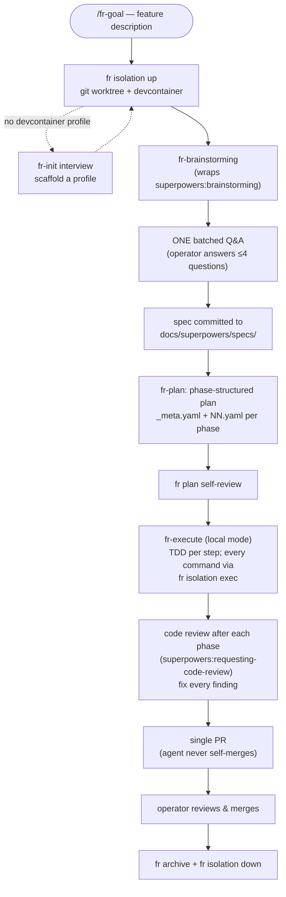
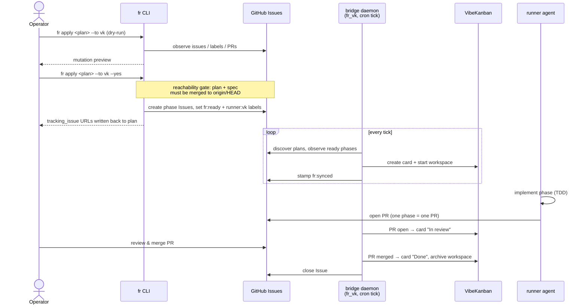

# super-fr

[](https://github.com/derio-net/super-fr/releases)
[](https://github.com/derio-net/super-fr/actions/workflows/ci.yml)
[](LICENSE)

A Claude Code plugin suite that turns a feature description into a reviewed PR.
It wraps [superpowers](https://github.com/obra/superpowers) with phase-structured
plans, mandatory workspace isolation (git worktree + devcontainer), an
end-to-end goal-to-PR pipeline, and dispatch of plan phases to autonomous
runners — [VibeKanban](https://github.com/BloopAI/vibe-kanban) today.

Built and dogfooded by [derio-net](https://github.com/derio-net); installable
anywhere Claude Code runs.

## What's in the box

| Component | Type | What it does |
|-----------|------|--------------|
| `super-fr` | plugin | 7 skills: brainstorm → plan → execute, isolation, the `/fr-goal` pipeline |
| `super-fr-dispatch` | plugin | 2 skills: dispatch plan phases to runners, operate/debug a runner |
| `fr` | Python package | The CLI: plan-as-folder engine, GitHub tracking (render → observe → diff → apply), isolation |
| `fr-dispatch` | Python package | Runner protocol + tick framework (library, runner-agnostic) |
| `fr-vk` | Python package | VibeKanban adapter: MCP client, card/workspace dispatch, bridge daemon |

## Architecture

Both flows share the same artifacts — a spec (`docs/superpowers/specs/`) and a
plan-as-folder (`docs/superpowers/plans/<slug>/`). Flow 1 is one continuous
agent session working in isolation on your machine. Flow 2 queues merged plan
phases to a runner that executes them asynchronously, one agent per phase.

### Flow 1 — goal to PR, locally (`/fr-goal`)

The operator describes a feature, answers one batched round of questions, and
gets back a single reviewed PR. Everything in between — brainstorming via
superpowers, spec, plan, TDD implementation, code review — runs autonomously
inside an isolated workspace.



### Flow 2 — dispatch phases to a runner (`fr apply --to vk`)

Once a plan is merged, its phases can be queued to a runner instead of being
executed locally. `fr apply` mirrors each phase to a GitHub Issue; a cron
bridge daemon hands ready phases to VibeKanban, which spawns one agent
workspace per phase. Each phase comes back as its own PR.



The flows compose: author a plan with Flow 1's front half (brainstorm → spec →
plan → merge), then fan its phases out to a runner with Flow 2. Without
`--to`, `fr apply` is tracking-only — Issues mirror the plan but no runner is
involved.

## Quickstart

### Install

As a Claude Code plugin (recommended) — add to `~/.claude/settings.json`:

```json
{
  "enabledPlugins": {
    "super-fr@derio-net": true,
    "super-fr-dispatch@derio-net": true
  }
}
```

Or the full user-level install (skills + rules + `fr` CLI + MCP config):

```bash
git clone https://github.com/derio-net/super-fr
cd super-fr
./scripts/install.sh
```

CLI only:

```bash
uv tool install 'git+https://github.com/derio-net/super-fr#subdirectory=packages/fr'
```

### Run a goal end-to-end

In any repo with a devcontainer profile (or let `fr-init` scaffold one):

```
/fr-goal add rate limiting to the webhook receiver
```

The agent isolates, brainstorms, asks its questions once, then drives
spec → plan → TDD implementation → review → a single PR for you to merge.

### Dispatch a merged plan to VibeKanban

```bash
fr apply docs/superpowers/plans/2026-06-04-my-feature --to vk        # preview (dry-run is the default)
fr apply docs/superpowers/plans/2026-06-04-my-feature --to vk --yes  # create Issues + queue labels
```

### Discover state

```bash
fr status docs/superpowers/plans/<slug>   # read-only plan report (never mutates)
fr skills                                 # condensed overview of skills + CLI
```

## Isolation: worktrees + devcontainers

Every run happens in an isolated workspace — there is **no unisolated
fallback**. Isolation is two layers:

- **Workspace isolation** — a git worktree at
  `~/.cache/vk/worktrees/<repo>/<branch>`, outside the base repo. The
  operator's checkout is never touched: no stray checkouts, stashes, or
  half-finished state.
- **Environment isolation** — a devcontainer per committed profile
  (`.devcontainer/<profile>/devcontainer.json` + `.devcontainer/vk-profiles.yaml`).
  Secrets stay host-side in `~/.config/vk/secrets/<repo>/<profile>.env` and are
  injected per profile, so a run only sees the credentials its profile grants.
  The default profile is least-privileged (e.g. `dev` with no tokens); an
  `admin` profile can carry `GH_TOKEN` for in-container pushes.

The lifecycle is a plain shell CLI any agent or human drives identically:

```bash
fr isolation up --branch feat/rate-limit --profile dev   # worktree + container
fr isolation exec --branch feat/rate-limit -- uv run pytest -q
fr isolation status                                      # worktree, container, PR state
fr isolation down --branch feat/rate-limit               # after the PR merges
```

**Exec-bridge discipline:** file edits happen on the host (the worktree is
host-visible); every build, test, lint, and run command goes through
`fr isolation exec -- …` inside the container. `down` refuses while the
linked PR is still open (unless `--force`), so cleanup can't race the
operator's final pushes.

A repo without a profile is a blocker, not a degraded mode: the `fr-init`
skill scans the repo, interviews the operator (profiles, tools, credential
key names, working patterns), and scaffolds profiles via `fr init scaffold`.
First run per repo pays this once.

## Skills

### super-fr

| Skill | Description |
|-------|-------------|
| `fr-goal` | End-to-end pipeline: brainstorm → one batched Q&A → spec → plan → TDD implementation → reviewed PR, no intermediate approval gates |
| `fr-brainstorming` | superpowers brainstorming, run inside an isolated workspace from the first command on |
| `fr-plan` | Phase-structured plans (plan-as-folder) with operator collaboration and spec index maintenance |
| `fr-execute` | Execute an agentic phase from a plan (agent-facing; Phase > Task > Step) |
| `fr-isolation` | Worktree + devcontainer lifecycle via the `fr isolation` CLI |
| `fr-init` | Scan a repo, interview the operator, scaffold devcontainer profiles |
| `fr-progress` | Status board, drift audit, spec rollup |

### super-fr-dispatch

| Skill | Description |
|-------|-------------|
| `fr-dispatch` | Queue a plan's phases to a runner (`fr apply --to <runner>`) and reconcile its GitHub Issues |
| `fr-runner` | Operate and debug a runner: tick health, stuck phases, orphan workspace recovery, dispatch metrics |

## `fr` CLI

| Command | Purpose |
|---------|---------|
| `fr apply` | Render + observe + diff + apply a plan to GitHub (dry-run by default; `--to <runner>` queues phases) |
| `fr status` | Read-only plan report (allowlist-safe; never mutates) |
| `fr archive` | Move finished plans (and specs) to `implemented/` |
| `fr undispatch` | Close a plan's tracking Issues and null the fields |
| `fr pickup` | Output phase scope (markdown) for an agent |
| `fr repair` | Normalize stale plan/spec refs (dry-run; `--yes` to write) |
| `fr plan` | Plan editing: `create`, `edit` (tick steps, complete phases), `self-review`, `rework` |
| `fr spec` | Spec status reporting |
| `fr isolation` | Isolated workspaces: `up`, `exec`, `status`, `down` |
| `fr init` | Devcontainer profile scaffolding (`scaffold`) |
| `fr migrate` | Plan format migration tools |
| `fr skills` | Condensed overview of the skills + CLI surface |

## Plan model

- **One plan = one repo's worth of work.** Plans live in the repo they modify.
- **One phase = one GitHub Issue = one PR.** Phases are scoped for reviewability.
- **Cross-repo features use multiple plans**, coordinated through the shared
  spec's "Implementation Plans" section (maintained by `fr-plan`).

A plan is a folder, not a file:

```
docs/superpowers/plans/<YYYY-MM-DD-slug>/
├── _meta.yaml    # slug, spec ref, target repo, schema version
├── _prose.md     # human-readable narrative
├── 01.yaml       # phase 1: tasks + steps (P1.T1.S1 IDs), depends_on, tag
└── 02.yaml       # phase 2 …
```

### Label lifecycle

Phases queued to a runner (`fr apply --to <runner>`) carry exactly one
protocol-owned lifecycle label, projected from GitHub state on every tick:

```
fr:ready ──→ fr:in-progress ──→ fr:pr-ready ──→ (closed)
   │
   └─ fr:blocked   while depends_on phases are incomplete
```

Plus two markers: `fr:synced` (handed to the runner — the idempotency stamp
that prevents re-dispatch) and `manual` (human-only phase, never routed to an
agent). Tracking-only Issues (no `--to`) carry no lifecycle label.

**Reachability gate:** `fr apply --yes` refuses to dispatch unless the plan
and spec are merged to `origin/HEAD` — the runner works from its own checkout
of main, so anything not on main would be invisible to it.

## Per-repo profile

Each repo can define `docs/superpowers/plan-config.yaml` to control filename
patterns, required headers, status values, auto-appended post-deploy phases,
and dispatch config (project board, labels, target repo).

## Requirements

- [superpowers](https://github.com/obra/superpowers) plugin (super-fr wraps its
  brainstorming, TDD, and review skills)
- GitHub CLI (`gh`) authenticated
- Docker (devcontainers for isolation)
- [uv](https://docs.astral.sh/uv/) (for the `fr` CLI)
- [VibeKanban](https://github.com/BloopAI/vibe-kanban) MCP server — only for
  dispatch (`npx vibe-kanban@latest --mcp`)
