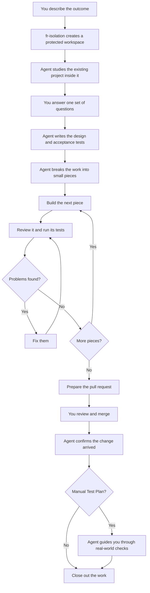
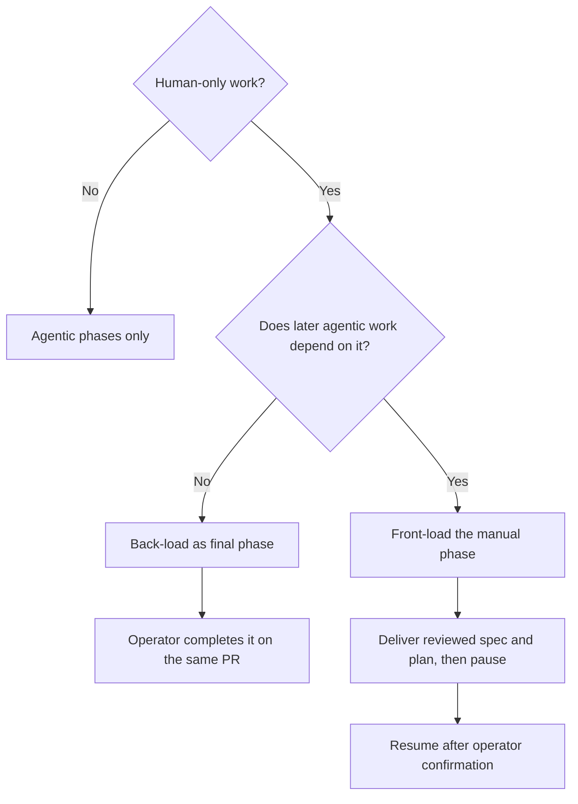

## Overview

Imagine handing a capable development team a short description of a feature.
The team studies the existing product, asks one organized set of questions,
then designs, builds, tests, and reviews the change. You return when a pull
request is ready for your review. `fr-goal` gives an AI coding agent that shape
of responsibility.

The important idea is not "the agent writes code by itself." The important
idea is that the agent owns the **whole journey** from an outcome to a reviewed
change. It does not repeatedly ask you to approve documents or tell it to
continue. Instead, it works in small loops: build something, check it, fix what
the check finds, then continue.

That autonomy begins with a hard physical boundary. Before the agent explores
the project or asks its first question, **`fr-isolation` creates a separate
workspace and starts the project's development container**. All later stages
reuse that workspace. The original checkout is not the place where autonomous
work happens, and a missing container profile stops the run rather than
silently weakening this guarantee.

Verification also happens at two levels. **Acceptance tests** gather evidence
that the promised user-visible behavior works while the feature is being built.
For a deployed change, a separate **manual Test Plan** checks the result in the
real environment after merge. The agent does not merely leave that plan in the
pull request: it returns after the merge and walks the operator through it.



This is autonomous work, not blind work. `fr-goal` stops when a choice belongs
to you, when an action needs human access, or when it encounters a blocker it
cannot safely resolve. It never interprets an unanswered question as consent
(`plugins/super-fr/skills/fr-goal/SKILL.md:14-30`). The reviews shown above are
agent-driven and disclosed in the pull request; you still perform the human
review and decide whether to merge.

## When it triggers

Use `fr-goal` when you know the outcome you want and want the agent to own the
delivery process, not merely suggest a design or edit one file. A useful request
states the outcome first and uses the remaining context for constraints that
are specific to this feature:

```text
/fr-goal Add import and export of saved dashboard filters.
Preserve existing filters, use a documented JSON format, and include migration tests.
```

The command itself already means "ask once, work autonomously, and take this to
a pull request," so repeating that contract wastes the most useful part of the
prompt. Add business rules, compatibility requirements, examples, or known
risks instead.

The skill also recognizes `/goal` and natural-language requests such as "build
this autonomously" or "take this to a PR"
(`plugins/super-fr/skills/fr-goal/SKILL.md:3-9`). Use interactive
`fr-brainstorming` instead when you want to shape the design together over
several conversations. `fr-goal` also requires the repository's isolated
development environment; if that has not been set up, it pauses and offers the
setup interview rather than working directly on your machine
(`plugins/super-fr/skills/fr-brainstorming/SKILL.md:22-38`).

## Workflow

The simple loop above is assembled from several narrower super-fr features.
Each one solves a different failure mode: damaging the original checkout,
building the wrong thing, losing track of unfinished work, hiding human-only
steps, merging before review fixes arrive, or cleaning up before the change is
actually present. The following sections introduce each feature at the point
where it joins the whole.

### 1. Establish the boundary before everything else (`fr-isolation`)

Before reading deeply, running measurements, asking design questions, or
changing code, `fr-goal` creates an **isolation** for this one goal. This is not
just a temporary folder. It combines two boundaries:

- A separate Git worktree holds the branch and file changes outside the
  original checkout.
- A devcontainer supplies the tools and runtime used to build and test those
  changes.

The worktree remains visible on the host, so the agent can edit it normally.
Builds, tests, and project commands cross an execution bridge into the
container. Authenticated Git and GitHub operations stay on the host, while the
container receives only the secrets explicitly assigned to its profile and no
SSH identity (`plugins/super-fr/skills/fr-isolation/SKILL.md:63-77`).

Technically, `fr-goal` reaches this through `fr-brainstorming`, which runs
`fr isolation up`. A new feature branch is normally based on the latest remote
default branch. Source lives in a linked Git worktree outside the base clone;
project commands run inside its devcontainer
(`plugins/super-fr/skills/fr-brainstorming/SKILL.md:22-41`).

The same isolation persists through brainstorming, specification, planning,
implementation, review fixes, and pull-request delivery. There is no handoff to
a less protected workspace halfway through the run. An isolation marker,
tool-layer edit hook, and session-sentinel Bash guard also make accidental drift
back into the base checkout harder. These are discipline backstops with
documented escapes and fail-open cases, not a security boundary.

### 2. Explore first, then ask once (`fr-brainstorming`)

The agent does not begin by asking questions it could answer from the project.
It first studies how the current system works and compares possible approaches.
Only then does it collect the decisions that genuinely belong to you into one
question set, with no more than four questions and recommended choices first.
A deployed change may include a question about how you will verify it in the
real environment (`plugins/super-fr/skills/fr-goal/SKILL.md:32-40`).

An unanswered batch is a hard stop. "Recommended" communicates judgment; it is
not a timeout default. Straggling decisions are batched rather than dripped out
as repeated interruptions (`plugins/super-fr/skills/fr-goal/SKILL.md:38-41`).
This is why "one operator touchpoint" describes the expected path, not an
unconditional promise of one conversation turn.

| Event | Pause? | Why |
|---|---:|---|
| Initial product and architecture decisions | Yes, once | These decisions belong to the operator. |
| Spec and plan approvals | No | Approval pauses become review-and-fix passes. |
| A valid code-review finding | No | The agent fixes it and tests the fix. |
| A factually incorrect finding | No | The agent records a reasoned refutation. |
| Missing access, profile, or required answer | Yes | Guessing would change scope or cross a boundary. |
| Secret, UI operation, or deployment | Yes | These become manual phases. |
| PR merge | Yes | The agent never self-merges. |
| Post-merge environment validation | Usually | It needs the deployed environment. |

### 3. Define how success will be proved (acceptance tests)

Your answers become a **specification**, a document that says what will change
and why. The agent checks that document against both your answers and the
existing project. If it refers to a service, helper, or path that does not
exist, the discrepancy must be resolved before planning. The file lives at
`docs/superpowers/specs/<YYYY-MM-DD-slug>-design.md`
(`plugins/super-fr/skills/fr-goal/SKILL.md:43-49`).

The important promises also become **acceptance tests**: concrete statements of
what a user or operator must be able to do when the feature is complete. For
example, "a saved filter survives export and import" is acceptance; "a helper
returns a dictionary" is only an implementation detail.

super-fr records each promise as a row in its acceptance matrix. The row starts
as not implemented, identifies the intended verification level, and is linked
to the plan phase that will satisfy it. As implementation lands, `fr-goal`
updates the row with honest evidence such as a unit, integration, or end-to-end
test. This prevents completed code from being mistaken for proven behavior.
Under `fr-goal`, the agent presents these rows and a short defense for each
during spec review rather than asking for another approval
(`plugins/super-fr/skills/fr-brainstorming/SKILL.md:64-73`,
`plugins/super-fr/skills/fr-plan/SKILL.md:79-84`).

Not every promise can be automated immediately. Any remaining acceptance debt
stays visible in the final pull request instead of being quietly described as
done (`plugins/super-fr/skills/fr-goal/SKILL.md:101-111`).

### 4. Turn the design into a checkable plan (`fr-plan`)

The specification says what success means; the plan says how to get there.
`fr-goal` invokes `fr-plan` to divide the work into phases and small steps. It
skips `fr-plan`'s usual section-by-section approval because the reviewed spec
already records your decisions. Each phase carries its own checklist, tests,
dependencies, and links to the acceptance criteria it advances
(`plugins/super-fr/skills/fr-plan/SKILL.md:15-38`,
`plugins/super-fr/skills/fr-plan/SKILL.md:63-84`).

Before implementation, `fr plan self-review` must pass. The agent also reads
the phases against the spec to ensure every requirement is covered. The CLI
errors on defects such as dependency cycles and manual work hidden inside an
agentic phase; when a local Test Plan and readable acceptance matrix are
present, it also errors on unknown acceptance IDs. It warns about unresolved
local spec references (`packages/fr/src/fr/plan_ops.py:832-1026`).

### 5. Separate work only a human can do (manual phases)

Some work cannot safely be delegated: entering a secret, approving an account,
changing a setting in a web interface, or deploying into an environment only
you can access. The plan labels this as a **manual phase** rather than hiding it
inside an automated step. `fr-goal` then decides where that phase belongs:



Back-loading is the default. The final PR labels the phase as unimplemented,
and the operator performs it and records a completion note on the same branch.
Front-loading is reserved for genuine prerequisites; then the manual
instructions are themselves the first deliverable
(`plugins/super-fr/skills/fr-goal/SKILL.md:67-79`).

### 6. Build, test, and review in a loop (`fr-execute`)

Now the central loop from the opening diagram begins. For each automated phase,
`fr-execute` guides the agent through writing a failing test, implementing the
behavior, and cleaning up without changing that behavior. This test-first
cycle is commonly called **TDD**, or test-driven development.

The work stays in the original isolated workspace so the agent retains your
answers, the design reasoning, and the plan. Progress is recorded step by step,
and acceptance rows are updated only when there is honest test evidence
(`plugins/super-fr/skills/fr-goal/SKILL.md:81-87`,
`plugins/super-fr/skills/fr-execute/SKILL.md:79-82`).

At each completed phase, or after all implementation for a small plan, the
agent reviews the spec, plan, and code together. It fixes every valid finding
with tests. It may reject a finding only with explicit, factual reasoning;
silent dismissal is not allowed
(`plugins/super-fr/skills/fr-goal/SKILL.md:94-99`).

### 7. Keep delivery in draft until the checks pass

The agent opens one **draft pull request**, a visible change that GitHub marks as
not ready to merge. It remains a draft while reviews and fixes continue. Only
after the full test suite and plan checks pass does `fr-goal` mark it ready for
your review (`plugins/super-fr/skills/fr-goal/SKILL.md:89-105`).

This ordering follows a recurring failure: implementers opened mergeable PRs
before orchestration review, operators merged them, and later fixes were pushed
to branches whose PRs were already closed. The draft state, a merged-PR push
guard, and post-merge content verification now protect that transition
(`docs/superpowers/implemented/specs/2026-06-20-fr-goal-merge-race-guard-design.md:34-159`).

The final PR discloses the spec and plan, review findings and fixes, refuted
findings, unfinished manual work, operator-driven Test Plan, and remaining
acceptance debt. The agent then stops. Merge remains the operator's decision
(`plugins/super-fr/skills/fr-goal/SKILL.md:101-112`).

### 8. Confirm the merge, then drive the manual Test Plan

When you report the merge, `fr-goal` checks that the final result actually
arrived on the project's main line before deleting its workspace. It runs
`fr isolation verify-merge`, freshly fetches the default branch, confirms the
PR state, and compares that content. This deliberately verifies results rather
than commit identity, so squash, rebase, and merge commits are supported. If a
late fix is missing, the workflow stops for a cherry-pick or fresh PR instead
of archiving incomplete work (`packages/fr/src/fr/commands/isolation_cmd.py:313-371`,
`packages/fr/src/fr/isolation/local.py:400-424`).

For a change that must be proven in a deployed environment, the specification
contains a **manual Test Plan** agreed during the initial question round. This
is different from the acceptance tests gathered during implementation: it may
require opening the real application, observing production behavior, checking
a dashboard, or performing an operation with access the isolated agent does not
have.

After merge verification, the agent drives this session interactively. It
presents the next check, asks the operator to perform or observe the human-only
part, records the result, and continues until the plan passes or a failure
requires recovery. It then reports any remaining acceptance debt, confirms plan
completion, archives the plan and eligible spec through a housekeeping PR, and
tears down isolation or lets garbage collection reap it
(`plugins/super-fr/skills/fr-goal/SKILL.md:22-30`,
`plugins/super-fr/skills/fr-goal/SKILL.md:114-120`).

### When one goal spans several repositories

The delivery unit is still one repository: one workspace, one plan, one branch,
and one PR. A coordinating spec may cover several repositories, but `fr-goal`
locates each checkout and assigns one isolated agent per other repository.
Dependencies between repositories live in the spec and PR order, not in a
plan phase's local `depends_on` field
(`plugins/super-fr/skills/fr-goal/SKILL.md:51-57`,
`plugins/super-fr/skills/fr-goal/SKILL.md:78-79`).

## Configuration

There is no separate `fr-goal` settings screen or command configuration. It
takes the feature-specific intent from your request and gets the rest from the
project: its isolated development environment, specification folder, plan
folder, and acceptance criteria.

| Input or boundary | Source | Effect |
|---|---|---|
| Goal and autonomy request | Operator prompt | Defines scope and activates the skill. |
| Product decisions | One batched Q&A | Constrains the spec and all later work. |
| Devcontainer profile | `.devcontainer/<profile>/devcontainer.json` | Defines isolated execution. |
| Profile secrets | `~/.config/fr/secrets/<repo>/<profile>.env` | Exposes only configured runtime secrets. |
| Spec | `docs/superpowers/specs/` | Records design, acceptance tests, and optional manual Test Plan. |
| Acceptance matrix | `docs/acceptance/matrix.yaml` | Tracks each business promise and the evidence proving it. |
| Plan | `docs/superpowers/plans/<slug>/` | Defines phases, TDD steps, and acceptance-test links. |
| Manual-phase placement | Dependency on human action | Selects back-loaded continuation or front-loaded pause. |
| Repository topology | Local and cross-repo spec references | Produces one plan and PR per repository. |

The workflow is not one large program. The skill provides the sequence and
decision rules; smaller commands and safety checks enforce the risky parts.
They protect the original checkout, inspect the plan, prevent remote work from
starting before its instructions are available, warn about pushes to closed
pull requests, and compare the merged result. These checks are guardrails with
documented limits, not a security boundary.

## Try it yourself

Start in a repository that has been prepared for super-fr. State the outcome on
the first line, then use the second line for constraints that are unique to the
feature:

```text
/fr-goal Add import and export of saved dashboard filters.
Keep existing saved filters compatible, document the JSON format, and test round trips.
```

Expect this visible sequence:

1. The agent announces `fr-goal` and starts isolation before examining code.
2. It explores the implementation and asks one consolidated question set.
3. After your answers, it writes and reviews the spec without section approvals.
4. It creates and self-reviews the plan, then implements agentic phases with TDD.
5. It opens a draft PR, fixes review findings, verifies, and marks the PR ready.
6. You complete any disclosed manual phase and merge the PR.
7. After you report the merge, it verifies the merged content.
8. When a manual Test Plan exists, it guides you through each real-world check.
9. It reports remaining acceptance debt and closes out the isolated workspace.

If you leave a required design question unanswered, the expected output is not
a guessed implementation. The agent should restate the open questions and
wait. If a manual prerequisite blocks later code, expect a reviewed spec-and-
plan PR followed by a pause. Those stops are not failures of autonomy; they are
the controls that keep autonomous execution from silently making operator
decisions.

For a compact inventory of surrounding skills and commands, run `fr skills`.
The canonical contract is `plugins/super-fr/skills/fr-goal/SKILL.md`.
