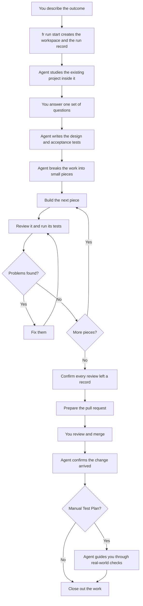
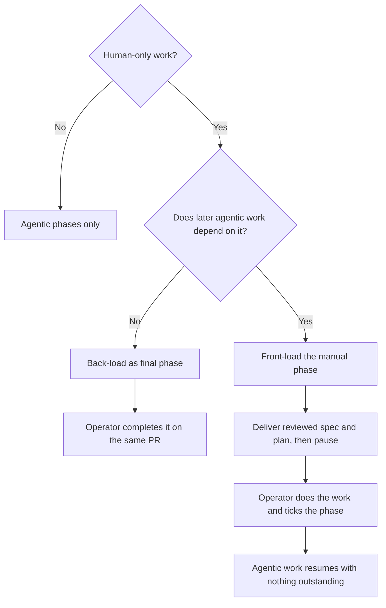

## Overview

Imagine handing a capable development team a short description of a feature.
The team studies the existing product, asks one organized set of questions,
then designs, builds, tests, and reviews the change. You return when a pull
request is ready for your review. `fr-goal` gives an AI coding agent that shape
of responsibility.

The important idea is not "the agent writes code by itself." The important
idea is that the agent owns the **whole journey** from an outcome to a reviewed
change. It does not repeatedly ask you to approve documents or tell it to
continue. Instead, it works in small loops: build something, check it, fix what
the check finds, then continue.

The journey itself is written down. A **workflow shape** is a small YAML file
that lists the steps of a run — brainstorm, review the spec, plan, review the
plan, implement (with a review running inside every phase), confirm every
review left a record, deliver — and `fr-goal`
reads that file rather than containing the sequence in its own prose. Asking for `fr-goal` with no argument
runs the shape described in this article: feature delivery, test first. Naming
one, as in `fr-goal ux-research`, runs a different shape. A project can write
shapes of its own, or replace a shipped one by saving a file of the same name
in its own repository, without modifying the tool that runs them.

That autonomy begins with a hard physical boundary, and the boundary is
established before the first step of the shape runs — not by the run, but for
it. **`fr run start` creates the isolated workspace** — a separate Git worktree,
plus the project's development container — and only then writes down that a run
exists. Everything after that happens inside it. The original checkout is not
the place where autonomous work happens, and where containers are used, a
missing container profile stops the run rather than silently weakening this
guarantee.

A run also keeps a **durable record of its own progress**. A file on the feature
branch says which step the run is on, what each finished step produced, and
whether it is waiting on you. Without one, all of that would live in the
conversation and end with it: interrupt the run, and the thread is gone. With
one, you can ask where a run got to, pick it back up, or read afterwards — in
the pull request, next to the code — what happened in what order.

Verification also happens at two levels. **Acceptance tests** gather evidence
that the promised user-visible behavior works while the feature is being built.
For a deployed change, a separate **manual Test Plan** checks the result in the
real environment after merge. The agent does not merely leave that plan in the
pull request: it returns after the merge and walks the operator through it.



This is autonomous work, not blind work. `fr-goal` stops when a choice belongs
to you, when an action needs human access, or when it encounters a blocker it
cannot safely resolve. It never interprets an unanswered question as consent
(`plugins/super-fr/skills/fr-goal/SKILL.md:14-27`, `:42-53`). The reviews shown above are
agent-driven and disclosed in the pull request; you still perform the human
review and decide whether to merge.

## When it triggers

Use `fr-goal` when you know the outcome you want and want the agent to own the
delivery process, not merely suggest a design or edit one file. A useful request
states the outcome first and uses the remaining context for constraints that
are specific to this feature:

```text
/fr-goal Add import and export of saved dashboard filters.
Preserve existing filters, use a documented JSON format, and include migration tests.
```

The command itself already means "ask once, work autonomously, and take this to
a pull request," so repeating that contract wastes the most useful part of the
prompt. Add business rules, compatibility requirements, examples, or known
risks instead.

Because the pipeline is a shape, the command also takes an optional shape name.
`/fr-goal` runs the feature-delivery shape this article describes;
`/fr-goal <name>` runs another one that the project or the plugin provides
(`plugins/super-fr/skills/fr-goal/SKILL.md:14-27`). Most requests never need
the argument, and nothing about the rest of this article changes when you use
it: the machinery is the same, only the list of steps differs.

The skill also recognizes `/goal` and natural-language requests such as "build
this autonomously" or "take this to a PR"
(`plugins/super-fr/skills/fr-goal/SKILL.md:1-10`). Use interactive
`fr-brainstorming` instead when you want to shape the design together over
several conversations. `fr-goal` also requires the repository's isolated
development environment; if that has not been set up, it pauses and offers the
setup interview rather than working directly on your machine
(`plugins/super-fr/skills/fr-brainstorming/SKILL.md:23-53`).

## Workflow

The simple loop above is assembled from several narrower super-fr features, and
the assembly itself is a file you can open. Each feature solves a different
failure mode: damaging the original checkout, building the wrong thing, losing
track of unfinished work, hiding human-only steps, a skipped review looking
identical to a clean one, merging before review fixes arrive, or cleaning up
before the change is actually present. The two sections
below describe the file that orders those features and the record that tracks
them; the numbered sections after that introduce each feature at the point where
it joins the whole.

### The pipeline is a manifest, not a script

Here are two steps from the shape that runs when you ask for `fr-goal` with no
argument (`plugins/super-fr/workflows/fr-goal.yaml`):

```yaml
workflow: fr-goal
unit: run
requires: [git, tests, scm]

steps:
  - id: brainstorm
    kind: agent
    skill: super-fr:fr-brainstorming
    gate: operator
    emits: [spec, journal:spec]

  - id: plan-review
    kind: cli
    run: fr plan self-review {{ artifacts.plan }}
```

Three ideas in that fragment do most of the work.

**A step declares its kind.** `kind: cli` marks a deterministic command. `fr`
runs it directly and the exit code is the verdict — nothing interprets the
result, nothing negotiates with it. `kind: agent` marks judgment work, and
`fr` does not run those steps at all. It prints a brief saying which skill or
agent should do the work, what that work needs, and what it must produce; the
coding agent does the work; the outcome is then recorded back into the run.
That separation is deliberate rather than incidental. It keeps the engine a
plain program you can read, re-run, and get the same answer from, and it means
every unpredictable part of the pipeline happens on the far side of a clearly
marked handoff where a human can see it. There is no path through the engine
that could call a language model even by accident.

**A step can carry a gate.** `gate: operator` means the run stops there until a
person answers. The shipped shape declares exactly one such gate, on the
batched question round — the single operator touchpoint the pipeline promises.
An unanswered gate is a stop, not a timeout with a default. On Claude Code the
tool checks the stop really happened: clearing the gate needs an answered
question in the session's transcript since the run paused there. An agent that
decides the request already settled everything can still clear it without
asking, but only by writing down why, and that reason lands in the pull
request. Where the transcript cannot be read, the tool says the gate is only
advisory rather than implying it is enforced.

The same rule, *evidence you did not write yourself*, governs the two other
places a run could vouch for its own work. A phase's review has to name the
separate reviewer that performed it, and never the agent that wrote the code.
Delivery has to name the log of a test run the orchestrator did itself, not a
report it received from a helper. The tool can confirm who wrote that log and
when; it cannot confirm the command was a real test suite. That check is aimed
at a relayed "all green", not at deliberate forgery.

**A step declares what it needs and what it emits.** Artifacts are named —
`spec`, `plan`, `pr` — so a later step can find the specification an earlier
step wrote, and so the tool can tell whether the inputs a step depends on
actually exist before anything is dispatched anywhere.

Shapes are looked up in one order: your repository's
`docs/superpowers/workflows/<name>.yaml` first, then the copy shipped with the
plugin. A repository file of the same name replaces the shipped shape whole.
There is no field-by-field merging, and that is a decision rather than an
omission: a list of steps that is half yours and half the plugin's fails in
ways that are very hard to see. `fr workflow check` validates a shape before
you rely on it: unique step ids, no cycles, every `needs` satisfiable, and only
capabilities drawn from a known list, so a typo is an error you see rather than
a step that quietly never runs
(`docs/superpowers/specs/2026-08-14-workflow-shapes-and-workitem-dispatch-design.md`,
section 4.A).

### The run keeps its place

Starting a run creates `docs/superpowers/runs/<run-id>.yaml` inside the isolated
workspace. It holds the shape's name, the branch, the **cursor** — the step the
run is currently on — and one record per step: pending, running, blocked on a
gate, done, or failed, along with the paths of whatever that step produced.

Six commands move it. `fr run start` begins a run; `fr run status` prints
where it is; `fr run advance` executes the step under the cursor if it is a
command, or prints the dispatch brief if it is agent work; `fr run claim`
records which agent took that brief; `fr run resolve` records how a dispatched
step turned out and answers an operator gate; and `fr run check` fails loudly
when the cursor is sitting on a failed step.

Advancing twice does not hand out the same work twice. If the step under the
cursor is already running — an agent was dispatched and has not reported back —
`fr run advance` refuses, names when that dispatch happened, and gives you the
two ways forward: resolve the step, or, if you are convinced the agent is truly
lost, `fr run advance <run-id> --redispatch` to re-issue the brief on purpose.
The refusal matters more than it might seem. Agent work is a natural place for
one conversation to end and another to begin, and advancing is the obvious first
move on the way back in; without the refusal the second advance prints a brief
indistinguishable from the first, and two agents edit the same worktree at once.
`--redispatch` re-issues the brief for the unit that is outstanding and nothing
else: it never selects a different unit, and it refuses in turn when nothing is
running at all, because reaching for it then means your picture of the run is
wrong, and saying so is more use than quietly behaving like an ordinary advance.

One more command creates a run rather than moving one. If your `fr` was
upgraded while a plan was already half-implemented, that work predates the run
model and has no cursor at all; `fr run adopt <plan-dir>` reconstructs one from
what is already on disk — which phases are finished, which spec the plan came
from — so the plan rejoins the pipeline instead of being stranded outside it.
The upgrade only ever *offers* this: it prints the command and adopts nothing
on your behalf, because an unrelated command should not quietly add tracked
files to your repository.

Two details make this more than bookkeeping. First, a failed step **does not**
move the cursor. Success advances, failure stays put, so a stalled run keeps
reporting the same step until someone deals with it rather than sliding past it.
Second, the file is committed on the feature branch, not kept in a scratch
directory. That is why the run arrives in the pull request alongside the code:
a reviewer can see which steps ran, what each one emitted, and where the run
paused, without having been present for it. When the plan is archived after
merge, its run record is archived with it.

### Who is holding this phase right now?

That question sounds like idle curiosity until a phase has been running for an
hour and you cannot tell whether the agent doing it is alive. It came up for
real: eight phase executors were dispatched across two runs, and hours later the
harness still listed one of them as running, with no way to tell from the run
record whether that was a stuck agent or an accounting artifact.

So a dispatch is now written down as it happens. When `fr run advance` prints a
brief, it records that it did — the kind of agent the brief was for, the model
the phase's difficulty tier resolved to, the harness that resolved it, and the
moment it went out. A tier does not resolve to a model in the abstract; it
resolves *for* a particular harness, so the two are kept in the same record
rather than leaving a model sitting there with nothing to explain where it came
from. What `fr` cannot know is *which* agent picked the brief up, because only
the orchestrator that dispatched it ever sees that identifier. That is what
`fr run claim <run-id> --step <step> --item phase/<n> --agent <id>` is for, and
it is called immediately after dispatching rather than when the agent returns —
an identity that only arrives on the way back cannot answer a question you have
while you are waiting. `fr run status` then shows each phase with its holder and
since when, and `fr run check` counts dispatches that are still open, or that
nobody claimed, as visible debt rather than as errors.

That last sentence about timing is true of some harnesses and not others, and
the first live run on a second one is what showed it. Where dispatching hands
back an identifier at once and lets the agent work in the background, you claim
while you wait, exactly as described. Where the dispatch call *blocks* — it
does not return until the agent has finished, and the identifier comes back
with the result — there is no moment in between to claim in. The record is
still opened, the harness and the model are still written down, and a second
dispatch is still refused; but while the phase is running the honest answer to
"who is holding this" is *an unclaimed agent on this harness*, and the name
only arrives afterwards. The tool now says which harness is which, rather than
describing the better case as if it were the only one.

One more limit on what the record may say: a model is written down only when
the tool has *seen* it. A tier binding says which model a dispatched phase
*should* get, and that is a promise, not an observation. For a while the tool
wrote the tier's model beside steps the orchestrating agent performed itself,
and the archive of this very project holds seven reviews credited to a model
that did not perform them. Now it reads the session's own transcript, where
every reply names the model that produced it. A dispatched phase records the
model that actually served it, not the alias it was asked for, and a step the
orchestrator ran records the orchestrator's model. If you bind an
`orchestrator` model and the session is running on something else, every
`fr run advance` warns you. It never blocks: which model you run is your call.

The same record doubles as a lock. Ask `fr run advance` to brief a phase whose
dispatch is still open and it refuses: exit code 2, naming the holder, printing
no brief at all. That refusal matters more here than it would elsewhere, because
every phase executor works in the *same* isolated worktree — it is deliberately
denied one of its own, since a second worktree would strand it on the main
branch where the spec and plan do not yet exist. Two executors briefed for one
phase would therefore be two writers in one checkout, with nothing else standing
between them.

When an executor genuinely is not coming back, two named moves get you out
rather than one improvised one. `fr run claim … --abandoned` closes the record
without resolving the step, so the phase is free and the next `fr run advance`
briefs it again; `fr run advance <run-id> --redispatch` does the closing and the
re-briefing in a single step. Neither erases the previous holder. The records
accumulate per phase, oldest first, so the pull request carries the whole
history of who was asked to do what — including the attempt that was abandoned,
which is usually the one worth reading.

### What did that phase cost, and who spent it?

There is one record per phase and every attempt lives on it, so a phase that had
to be dispatched twice keeps both rather than letting the retry overwrite what
came before. Each attempt also carries its own cost, printed by `fr run status`
directly beneath the holder that incurred it. Identity and spend on the same
line is the whole point: a number with no agent beside it cannot be argued with,
and the spend that produced nothing is usually the spend worth looking at.

Two numbers appear there, and they are deliberately never blended into one. The
first is an **estimate**, computed as the brief goes out: how much context this
dispatch is about to be handed — the journal, the handoff, the specification,
the plan. The second is a **measurement**, taken when the attempt closes and
read out of the harness's own accounting for that particular agent. On a real
phase of this feature's own run the estimate was about 23,600 tokens and the
measurement 56,092,764 — a factor of roughly two thousand, more than three
orders of magnitude apart. Neither number is wrong. The estimate describes one
prompt. The measurement is everything the harness billed across every turn the
agent took, cached reads included, which over a long phase is largely the same
context re-sent dozens of times. Averaged into a single figure they would
produce a number that is true of nothing, so `fr` prints both, beneath the same
holder, and says in writing that the two are not comparable.

A measurement is also refused more often than you might expect, and each refusal
is a fact rather than a gap. The transcript an attempt is measured from lives on
the machine that ran it, under the session that dispatched it, and neither
travels with the branch. So if you push a run mid-phase and pick it up on
another host, that attempt's cost reads *not observable from here* rather than
zero: `fr` will not fall back to a time window and quietly charge you for
whatever else happened to be running inside it. That refusal carries better news
than the cost does. A holder dispatched from a session this one cannot see may
well have died with its host, so `fr run advance` says exactly that when it
refuses, instead of leaving you waiting on it, and `fr run claim … --abandoned`
is the way on. Re-briefing then starts from the last commit, because uncommitted
work did not travel either.

### Ending a turn on a run that is waiting for nobody

The loop has one failure that no amount of recorded state can fix, because it is
not a state problem. An executor finishes and reports back; the report arrives
as a message; and the natural, well-mannered reply to a delivered report is to
summarize it and stop. Do that mid-run and nothing is broken — the record is
intact, the cursor is exactly where it should be, the next command is obvious —
and the run simply stops, waiting for a person who believed it was still going.
This happened three times in a single day before it was taken seriously.

Two things were done about it, and it is worth being clear which is which. The
first is wording: the skill now says that an iteration *ends on a dispatch*, not
on a report — review, fix, push, record the review, and then, in the same turn,
advance and brief the next phase, reporting afterwards rather than instead. That
is the weak fix, and it is also the portable one, because it works wherever the
skill is read.

The second is a mechanism, and it catches the consequence rather than the
inclination. `fr run check --idle` asks one question — is this run advanceable
with nobody working on it? — and answers it identically everywhere, exiting with
a distinct code when the answer is yes and naming the command that would move it
along. A legitimate stop is not idle: a run waiting on your answer, a manual
phase, a failed step, a finished run, and above all a phase an executor is
*still working on*. A turn that ends while a background agent is busy is exactly
right, and nothing interferes with it.

What each harness can do with that answer differs, and the difference is
declared rather than smoothed over. On Claude Code a stop-time hook can refuse
to let the turn end and hand the next command back, which is what it does — at
most once per position in the run, so that a command which keeps failing cannot
trap the session in a loop, and so that stopping on purpose needs nothing more
than stopping a second time. On OpenCode a stop cannot be refused at all; there
the plugin continues the session with that command instead, which is weaker, and
is recorded as weaker — it has not yet been proved on a live session. Where no
adapter exists, the wording above is all there is.

The Claude Code guard costs two things worth knowing about. It calls whichever
`fr` is on your `PATH`, so a global install older than the run it is guarding
simply fails, and the guard goes quiet — safe, but invisible, which is why it is
written down here rather than left to be discovered. And it adds one `fr`
start-up, roughly two seconds, to the end of every turn in a session that has a
workspace bound to it.

### 1. Establish the boundary before everything else (`fr run start`)

Before reading deeply, running measurements, asking design questions, or
changing code, `fr-goal` creates an **isolation** for this one goal. This is not
just a temporary folder. It combines two boundaries:

- A separate Git worktree holds the branch and file changes outside the
  original checkout.
- A devcontainer supplies the tools and runtime used to build and test those
  changes.

The worktree remains visible on the host, so the agent can edit it normally.
Builds, tests, and project commands cross an execution bridge into the
container. Authenticated Git and GitHub operations stay on the host, while the
container receives only the secrets explicitly assigned to its profile and no
SSH identity (`plugins/super-fr/skills/fr-isolation/SKILL.md:55-71`). On a host
with no container runtime the worktree is the isolation on its own, and the
project's container profile is not required.

Technically, this happens inside `fr run start`. It resolves the shape first —
so a mistyped shape name fails before any worktree or container is created —
then ensures the isolation for the branch, then writes the run's record inside
the resulting workspace. Every later command is run from there. A new feature
branch is normally based on the latest remote default branch
(`plugins/super-fr/skills/fr-brainstorming/SKILL.md:23-53`).

It is worth knowing why isolation is a precondition rather than the run's own
first step, because the alternative was tried and does not work. If entering
isolation were step one, the run's record would be written in the original
checkout and the worktree would be created afterwards — so the run could no
longer find itself from inside its own workspace, and a command like
`fr plan self-review` would look for a plan in the checkout where it does not
exist. A run recorded in the original checkout also misses the whole point of
recording it: it would not be on the feature branch, and would never reach the
pull request. A run is born in its workspace.

The same isolation persists through brainstorming, specification, planning,
implementation, review fixes, and pull-request delivery. There is no handoff to
a less protected workspace halfway through the run. An isolation marker,
tool-layer edit hook, and session-sentinel Bash guard also make accidental drift
back into the base checkout harder. These are discipline backstops with
documented escapes and fail-open cases, not a security boundary.

### 2. Explore first, then ask once (`brainstorm`)

The agent does not begin by asking questions it could answer from the project.
It first studies how the current system works and compares possible approaches.
Only then does it collect the decisions that genuinely belong to you into one
question set, with no more than four questions and recommended choices first.
A deployed change may include a question about how you will verify it in the
real environment (`plugins/super-fr/skills/fr-goal/SKILL.md:42-53`).

This is the shape's one operator gate, and an unanswered batch is a hard stop.
"Recommended" communicates judgment; it is not a timeout default. Straggling
decisions are batched rather than dripped out as repeated interruptions. When
you do answer, the step is closed by recording both the outcome and the path of
the specification it produced, which is how every later step knows where to
find that document. This is why "one operator touchpoint" describes the
expected path, not an unconditional promise of one conversation turn.

| Event | Pause? | Why |
|---|---:|---|
| Initial product and architecture decisions | Yes, once | These decisions belong to the operator. |
| Spec and plan approvals | No | Approval pauses become review-and-fix passes. |
| A valid code-review finding | No | The agent fixes it and tests the fix. |
| A factually incorrect finding | No | The agent records a reasoned refutation. |
| Missing access, profile, or required answer | Yes | Guessing would change scope or cross a boundary. |
| Secret, UI operation, or deployment | Yes | These become manual phases. |
| PR merge | Yes | The agent never self-merges. |
| Post-merge environment validation | Usually | It needs the deployed environment. |

How the pause is enforced differs by harness. On a harness with a built-in
structured question prompt, that prompt call is itself what pauses the run.
Elsewhere `fr-goal` cannot force a pause the same way: it puts the numbered
batch in its reply and ends the turn, and `fr run advance` says so loudly
there rather than behaving as though the gate had fired silently. Either way
the record travels with the run: resolving the gate types who actually
answered it — `agent` by default, `operator` only when typed deliberately
once the operator genuinely answered — and `fr run gates <run-id>` prints
that provenance, so a reviewer reading the delivered pull request can tell a
human-answered batch from one the agent had to clear on its own, rather than
trust silence.

### 3. Define how success will be proved (`spec-review` and acceptance tests)

Your answers become a **specification**, a document that says what will change
and why. The next step checks that document against both your answers and the
existing project. If it refers to a service, helper, or path that does not
exist, the discrepancy must be resolved before planning. The file lives at
`docs/superpowers/specs/<YYYY-MM-DD-slug>-design.md` — the path is
`fr-brainstorming`'s, which `brainstorm` invokes
(`plugins/super-fr/skills/fr-goal/SKILL.md:42-53`,
`plugins/super-fr/skills/fr-brainstorming/SKILL.md`).

The important promises also become **acceptance tests**: concrete statements of
what a user or operator must be able to do when the feature is complete. For
example, "a saved filter survives export and import" is acceptance; "a helper
returns a dictionary" is only an implementation detail.

super-fr records each promise as a row in its acceptance matrix. The row starts
as not implemented, identifies the intended verification level, and is linked
to the plan phase that will satisfy it. As implementation lands, `fr-goal`
updates the row with honest evidence such as a unit, integration, or end-to-end
test. This prevents completed code from being mistaken for proven behavior.
Under `fr-goal`, the agent presents these rows and a short defense for each
during the spec review rather than asking for another approval
(`plugins/super-fr/skills/fr-brainstorming/SKILL.md:67-79`,
`plugins/super-fr/skills/fr-plan/SKILL.md:63-91`).

Not every promise can be automated immediately. Any remaining acceptance debt
stays visible in the final pull request instead of being quietly described as
done (`plugins/super-fr/skills/fr-goal/SKILL.md:99-111`).

### 4. Turn the design into a checkable plan (`plan` and `plan-review`)

The specification says what success means; the plan says how to get there.
`fr-goal` invokes `fr-plan` to divide the work into phases and small steps. It
skips `fr-plan`'s usual section-by-section approval because the reviewed spec
already records your decisions. Each phase carries its own checklist, tests,
dependencies, and links to the acceptance criteria it advances
(`plugins/super-fr/skills/fr-plan/SKILL.md:15-38`,
`plugins/super-fr/skills/fr-plan/SKILL.md:61-95`).

Reviewing that plan is the shape's one command step, and a good illustration of
why the distinction between kinds matters. `fr plan self-review` runs against
the plan the previous step emitted, and its exit code decides whether the run
moves on; nobody has to judge whether the output "looks fine." The CLI errors on
defects such as dependency cycles and manual work hidden inside an agentic
phase; when a local Test Plan and readable acceptance matrix are present, it
also errors on unknown acceptance IDs, and it checks that a plan naming its own
workflow shape names one that actually resolves.

Hidden manual work is worth dwelling on, because it has a twin. The agent that
carries out an agentic phase — the phase executor of step 6 below — is a
**leaf**: it writes code, but it cannot hand work to another agent, on any of
the harnesses fr supports. So a step telling it to dispatch a researcher or a
reviewer of its own has nobody to carry it out. What makes that worse than a
plain error is what an obedient agent does next: it does the nearest thing it
can reach, and it ticks the step anyway — recording a finished phase for work
nobody performed. Self-review therefore errors on such a step at authoring
time, for the same reason it errors on manual work in an agentic phase: both
assign work to an actor that cannot do it. The executor is told to refuse as
well, and to leave the step unticked, because a tick is a claim of performance.
It warns about unresolved local spec references
(`packages/fr/src/fr/plan_ops.py:1135-1311`). The agent
fixes what it reports and advances the run again; there is nothing to record by
hand, because a command step completes itself.

### 5. Separate work only a human can do (manual phases)

Some work cannot safely be delegated: entering a secret, approving an account,
changing a setting in a web interface, or deploying into an environment only
you can access. The plan labels this as a **manual phase** rather than hiding it
inside an automated step. `fr-goal` then decides where that phase belongs:



Back-loading is the default. The final PR labels the phase as unimplemented,
and the operator performs it and records a completion note on the same branch.
Front-loading is reserved for genuine prerequisites; then the manual
instructions are themselves the first deliverable
(`plugins/super-fr/skills/fr-goal/SKILL.md:62-70`).

Where a manual phase may sit is a rule the tooling checks, not a convention you
are trusted to keep: a manual phase must be in the plan's trailing block, or
already complete. Turned around, that reads as the reason it exists — no manual
phase may still be **outstanding** when an agentic phase after it runs. A plan
shaped that way sends the loop into a phase whose prerequisite is a person who
has not acted yet, and there is nothing useful left for it to do but wait.
`fr plan self-review` errors on such a plan, so it fails at the plan-review step
above, before the first phase is dispatched and while the author is still
holding the plan. The `implement` step checks the same rule once more before
dispatching anything, because a plan adopted from disk may never have been
reviewed at all.

Both halves of the rule turn on *outstanding* rather than on *manual*, and that
is precisely what keeps front-loading legal. The right-hand branch of the
diagram above ends with you doing the work and ticking the phase, and that tick
is not a formality: it is what turns an outstanding prerequisite into a finished
one. After it, a later agentic phase may depend on the manual phase quite
happily, because depending on it no longer means waiting for anyone.

A manual phase is never dispatched. The per-phase loop below enumerates the
agentic phases only; a manual phase is recorded in the run as `manual`, and no
dispatch brief is built for it under any circumstances — there is no code path
that could offer human-only work to an agent. Nor is it quietly dropped: the
run's progress counts only the phases that will be dispatched and names the ones
that will not, so a tally of finished work never hides a phase that is sitting
there waiting for you.

### 6. Build, test, and review in a loop (`implement` and `review`)

Now the central loop from the opening diagram begins. The shape says this step
runs once per plan phase, so the phases are worked through in dependency order,
one at a time. Each one goes to a dedicated phase executor, which is given the
phase's scope, the specification, and the running journal of what earlier phases
discovered. It writes a failing test, implements the behavior, and cleans up
without changing that behavior. This test-first cycle is commonly called
**TDD**, or test-driven development.

Each phase carries a difficulty **tier**, assigned when the plan was written,
and that tier is what chooses the model the phase is implemented with. Every
turn of the loop is the same four moves: dispatch the executor, claim the
dispatch so the run knows who is holding this phase, wait for it, then resolve
the phase with how it went. The claim is a single extra command, and it is what
makes an unattended run inspectable from outside — see *Who is holding this
phase right now?* above.

The work stays in the original isolated workspace, so the design reasoning, the
plan, and your answers all remain in reach. The journal is what carries context
from one phase to the next: findings, decisions, and discoveries are written
down rather than being remembered, which is what makes a phase handover
survivable at all. Progress is recorded step by step, and acceptance rows are
updated only when there is honest test evidence
(`plugins/super-fr/skills/fr-goal/SKILL.md:75-88`,
`plugins/super-fr/skills/fr-execute/SKILL.md:52-100`).

At each completed phase the agent reviews the spec, plan, and code together — the
review is part of every phase iteration, not a single pass at the end. It fixes every
valid finding
with tests. It may reject a finding only with explicit, factual reasoning;
silent dismissal is not allowed. Each finding is recorded as open, fixed, or
refuted, and that durable list — not anyone's memory of the review — is what
the pull-request description is later written from
(`plugins/super-fr/skills/fr-goal/SKILL.md:90-94`).

A review is judgment work, the same kind of step as `brainstorm` or `plan`. Like
those, it finishes simply by being marked done, and on its own that leaves no
trace of what happened: a phase that got a careful review and a phase whose
review was rushed, or skipped outright, arrive at the same "done" with nothing
to tell them apart. Until now that was the one point in the whole pipeline
where skipping the work and doing it looked identical from outside the
conversation. So the agent writes the review down the same way it writes down
a finding — noting which phase it reviewed, and what it found, or that it
found nothing to fix.

Writing it down is now required rather than encouraged, and what changed is
where the requirement sits. Marking the review done is a command, and that
command asks for the written entry by name. Without it, the step is refused and
the refusal names the flag; and the identifier it is given is checked rather
than stored — it must be a review entry, and a review entry *for that phase*,
so that another phase's review, or a stray finding, cannot stand in for one
that was never written. A review that genuinely failed needs no evidence,
because a failed review met no obligation, and demanding proof of one would
make failure the hardest outcome to report. All of this exists for a single
distinction the pipeline could not previously make: "review skipped" and
"review passed clean" used to arrive at the same `done`. Now the first cannot
reach `done` at all.

A review entry proves that a review happened. It says nothing about what was
done with what the review found, and that turns out to be the easier half to
lose. Asking for a review and receiving one are two different disciplines:
the second is the unglamorous part, where each finding is checked against the
code, and then either fixed with a test that pins it or refuted with reasons
— never quietly dropped, and never agreed with just to be agreeable. For a
while the pipeline named only the first of the two, and left the second to
whichever agent happened to be holding the phase. So the step now names both,
in order, and backs the second with something it can actually observe. Naming
a discipline cannot prove anyone followed it; its outcome can be checked. When
the review is marked done, the tool reads the journal itself and refuses while
any finding raised against that phase is still open, printing the exact
command that closes each one. Nobody passes this in — a requirement satisfied
by typing a flag is satisfied by anyone who can type — and what gets recorded
is what the tool saw: the findings it found closed, or that there were none. A
finding that honestly belongs to a later phase is filed against that phase,
and holds *that* review open instead. The same check already ran once, at the
very end, just before delivery. It has simply moved to the moment a finding is
cheapest to fix: while the phase that caused it is still the one in hand.

What it deliberately does not do is reach backwards. A review marked done
before this gate existed is not retroactively failed; it is reported as
unevidenced debt and the run carries on. An obligation enforced backwards in
time would fail every run that happened to be in flight on the day the tool
updated, which is an efficient way to teach people to distrust the tool.

### 7. Confirm every review left a record (`journal-check`)

Before a pull request exists, one more step reads back across the whole plan.
For every phase that is finished and is not a manual one, it looks for the
record described above — an entry naming that phase as reviewed. Find one for
every such phase, and the run continues; find a phase with none, and the run
stops right there, before there is a pull request to hide the gap inside, with
a plain instruction to do the review, write it down, and try again. This check
only confirms that a record exists — it does not reopen the review, re-read
what it says, or judge whether it was thorough. That is a real limit, stated
plainly rather than implied away: a reviewer who wrote three careless words
passes the same way one who wrote three careful paragraphs does. What it
closes is narrower and still worth having — a skipped review can no longer
pass for free. Manual phases are exempt, because no agent review ever runs on
them
(`plugins/super-fr/skills/fr-goal/SKILL.md:96-97`).

Inside a run that walked the whole plan this step now finds nothing to
complain about, because the evidence gate in the loop above already refused to
close any of those reviews unevidenced. That is composition rather than
duplication: the gate fires per phase, as the phase finishes, and this one
reads back across work no cursor ever walked — a plan carried over from before
runs existed, a plan adopted midway, a phase added after the loop had already
finished. The same rule, asked twice, of two different populations.

### 8. Keep delivery in draft until the checks pass (`deliver`)

The agent opens one **draft pull request**, a visible change that GitHub marks as
not ready to merge. It remains a draft while reviews and fixes continue. Only
after the full test suite and plan checks pass does `fr-goal` mark it ready for
your review (`plugins/super-fr/skills/fr-goal/SKILL.md:99-111`).

This ordering follows a recurring failure: implementers opened mergeable PRs
before orchestration review, operators merged them, and later fixes were pushed
to branches whose PRs were already closed. The draft state, a merged-PR push
guard, and post-merge content verification now protect that transition
(`docs/superpowers/implemented/specs/2026-06-20-fr-goal-merge-race-guard-design.md:34-159`).

The final PR discloses the spec and plan, review findings and fixes, refuted
findings, unfinished manual work, operator-driven Test Plan, and remaining
acceptance debt — and, because the run's record is committed on the same branch,
the sequence of steps that produced all of it. The agent then stops. Merge
remains the operator's decision.

### 9. Confirm the merge, then drive the manual Test Plan

When you report the merge, `fr-goal` checks that the final result actually
arrived on the project's main line before deleting its workspace. It runs
`fr isolation verify-merge`, freshly fetches the default branch, confirms the
PR state, and compares that content. This deliberately verifies results rather
than commit identity, so squash, rebase, and merge commits are supported. If a
late fix is missing, the workflow stops for a cherry-pick or fresh PR instead
of archiving incomplete work (`packages/fr/src/fr/commands/isolation_cmd.py:455-516`,
`packages/fr/src/fr/isolation/local.py:492-525`).

For a change that must be proven in a deployed environment, the specification
contains a **manual Test Plan** agreed during the initial question round. This
is different from the acceptance tests gathered during implementation: it may
require opening the real application, observing production behavior, checking
a dashboard, or performing an operation with access the isolated agent does not
have.

After merge verification, the agent drives this session interactively. It
presents the next check, asks the operator to perform or observe the human-only
part, records the result, and continues until the plan passes or a failure
requires recovery. It then reports any remaining acceptance debt, confirms plan
completion, archives the plan, its journal, and its run record through a
housekeeping PR, and tears down isolation or lets garbage collection reap it
(`plugins/super-fr/skills/fr-goal/SKILL.md:113-117`).

### When one goal spans several repositories

The delivery unit is still one repository: one workspace, one plan, one branch,
and one PR. A coordinating spec may cover several repositories, but `fr-goal`
locates each checkout and assigns one isolated agent per other repository, each
running this same pipeline from planning onward in its own repo. Dependencies
between repositories live in the spec and PR order, not in a plan phase's local
`depends_on` field (`plugins/super-fr/skills/fr-goal/SKILL.md:55-60`).

The shape decides the granularity at which its work is handed out, by declaring
one of three units: a whole run as a single item, which is what the shipped
shape does; one item per plan phase; or one item per target repository of a
cross-repo spec. Because the unit is declared in the manifest rather than fixed
in the tool, how finely a goal is divided is a property of the pipeline you
chose, not of the machine that happens to run it.

## Configuration

There is still no `fr-goal` settings screen or per-command configuration. It
takes the feature-specific intent from your request and gets the rest from the
project: its isolated development environment, specification folder, plan
folder, and acceptance criteria. The sequence is one of those project-supplied
inputs too: a repository that wants a different pipeline writes a shape, rather
than looking for a flag that bends this one.

| Input or boundary | Source | Effect |
|---|---|---|
| Goal and autonomy request | Operator prompt | Defines scope and activates the skill. |
| Workflow shape | `docs/superpowers/workflows/<name>.yaml`, else the shipped copy | Defines the steps, their kinds, gates, and dispatch granularity. |
| Run record | `docs/superpowers/runs/<run-id>.yaml` | Tracks the cursor, each step's outcome, and what it emitted. |
| Product decisions | One batched Q&A | Constrains the spec and all later work. |
| Devcontainer profile | `.devcontainer/<profile>/devcontainer.json` | Defines isolated execution. |
| Profile secrets | `~/.config/fr/secrets/<repo>/<profile>.env` | Exposes only configured runtime secrets. |
| Spec | `docs/superpowers/specs/` | Records design, acceptance tests, and optional manual Test Plan. |
| Acceptance matrix | `docs/acceptance/matrix.yaml` | Tracks each business promise and the evidence proving it. |
| Plan | `docs/superpowers/plans/<slug>/` | Defines phases, TDD steps, and acceptance-test links. |
| Model per phase tier | `~/.config/fr/models.yaml` | Chooses which model implements a phase of a given difficulty. |
| Manual-phase placement | Dependency on human action | Selects back-loaded continuation or front-loaded pause. |
| Repository topology | Local and cross-repo spec references | Produces one plan and PR per repository. |

The workflow is not one large program. The shape supplies the sequence, the
skill supplies the judgment each step needs, and smaller commands and safety
checks enforce the risky parts. They protect the original checkout, inspect the
plan, prevent remote work from starting before its instructions are available,
warn about pushes to closed pull requests, and compare the merged result. These
checks are guardrails with documented limits, not a security boundary.

Shapes and run records arrived in super-fr 4.0.0, which is worth knowing in two
narrow cases. A plan that names its own workflow shape cannot be read by an
older `fr` at all, so such a plan requires the new version rather than
degrading; plans that name none are unaffected. And if you have written your own
runner to execute work elsewhere, its interface now receives a single work item
rather than a plan-and-phase pair, which is what allows one runner to serve
shapes of different granularity.

## Try it yourself

Start in a repository that has been prepared for super-fr. State the outcome on
the first line, then use the second line for constraints that are unique to the
feature:

```text
/fr-goal Add import and export of saved dashboard filters.
Keep existing saved filters compatible, document the JSON format, and test round trips.
```

Expect this visible sequence:

1. The agent announces `fr-goal`, starts the run, and enters isolation before
   examining code.
2. It explores the implementation and asks one consolidated question set.
3. After your answers, it writes and reviews the spec without section approvals.
4. It creates the plan, and the plan self-review runs as a command whose exit
   code decides whether the run continues.
5. It implements the agentic phases with TDD, one phase at a time, reviewing
   and fixing each one before moving to the next.
6. Once every phase is done, it confirms each one's review left a record —
   before any pull request exists.
7. It opens a draft PR, verifies, and marks it ready once the checks pass.
8. You complete any disclosed manual phase and merge the PR.
9. After you report the merge, it verifies the merged content.
10. When a manual Test Plan exists, it guides you through each real-world check.
11. It reports remaining acceptance debt and closes out the isolated workspace.

At any point you can ask `fr run status <run-id>` where the run has got to, and
after the fact the same record is in the pull request. If you leave a required
design question unanswered, the expected output is not a guessed
implementation. The agent should restate the open questions and wait. If a
manual prerequisite blocks later code, expect a reviewed spec-and-plan PR
followed by a pause. Those stops are not failures of autonomy; they are the
controls that keep autonomous execution from silently making operator
decisions.

For a compact inventory of surrounding skills and commands, run `fr skills`.
The canonical contract is `plugins/super-fr/skills/fr-goal/SKILL.md`, and the
shipped shape it drives is `plugins/super-fr/workflows/fr-goal.yaml`.
