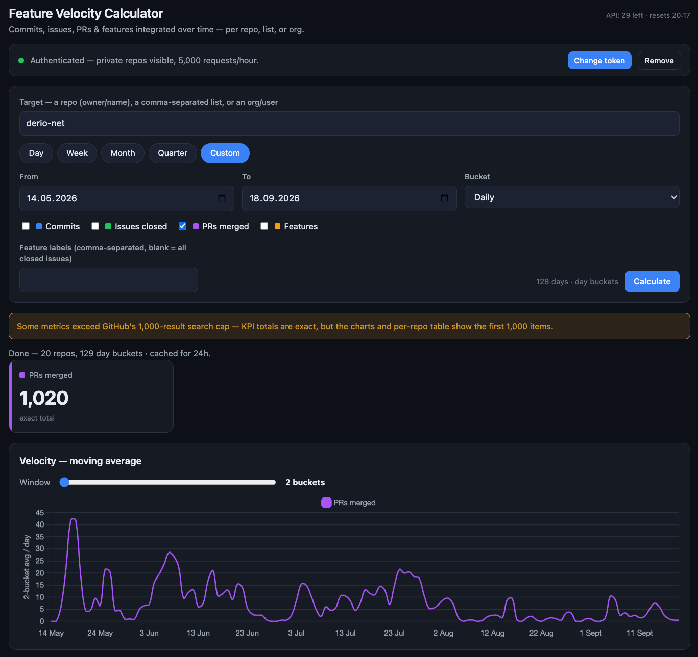

<!-- .slide: class="title" data-background-image="../diagrams/factory-line.png" data-background-size="cover" -->

<div class="topblock">

# Delivering more robust code safely using custom skills

## A personal experiment in overengineering the Superpowers skill

</div>

Note: I haven't written code since December. And I've never been more prolific. Like a lot of us, I was always coding for fun but I always had to be careful with my choices, as a project was a long-term commitment. With AI, that limitation is gone. I feel like a gambler in a casino, a alcoholic in a wine cellar, a diabetic in a candy shop. So I dove in and started building. But I also have demands of my code. It must a. work on the first try, b. be maintainable, c. be testable, d. be documented. This talk is my journey on how I am iteratively building a solution to this persistent frustration.

---

## What is this talk really about

1. **Structure and best practices** over free form discussion
2. **Agentic safety\* and autonomy** towards a goal
3. **High feature throughput** in local development

Note: LLMs are smart. But requirements are messy. And best practices are only wishes, until they are written down.. Agents are also powerful. They get access to your system and they can break things so they should be controlled, ideally in-depth.. And a smart, capable agent that needs hand-holding all the time is not really performing, so we should be able to "let them cook".

---

## Agenda

- **Three stations** - just the agent / superpowers / super-fr
- **Fourteen upgrades** towards fr-goal
- **Comparison** - just the agent (+ planning) vs `/fr-goal gh#429`
- **Annotated example** of a full run
- **Quickstart** - installation and your first goal
- **Discussion**

<p class="nav"><a href="#/2/1">detail ↓</a></p>

Note: So, today we'll talk about how I transformed my local development from "just using an agent", to the very promising superpowers Claude plugin, to upgrading it, step by step, until I got the Agent one-shot complex features with high confidence and build quality. This has allowed me, as a solo developer, in my free time, to implement and merge more that a thousand features since May. I have prepared a comparison between a "vanilla" feature development and the main loop of super-fr, fr-goal. Then we might take a look in the full run, if time allows.


--

## Feature velocity



<p class="nav"><a href="#/2/0">↑ back</a></p>
---

<!-- .slide: class="split" -->

<div class="col">
<div class="crumb"><strong>Stations</strong> &gt; Upgrades &gt; Comparison &gt; Example &gt; Quickstart &gt; Discussion</div>

## Station 1: Just the agent

```
prompt ──▶ plan in chat ──▶ code in base checkout
──▶ testing ──▶ commit + push
```
</br>

<!-- .element: class="chain" -->
- **Outcome in, approach out**: explores, asks on real decisions
- **Three modes**: interactive, plan-to-approve, autopilot
- **Validates** what you name, reruns on failure
- **No structured plan** (depends on the agent/harness)
- **Operator owned**: merge, secrets, production impact
</div>


Note: Everybody starts here. Open an IDE, run the harness CLI or the IDE plugin and go. For anything complex, you should start with a Planning session. Once you've discussed the feature or bug with the agent, the implementation part begins, based on the generated plan. The plan can optionally be persisted. The agent implements, the operator approves as needed and, once the implementation is done, it's the operator's responsibility to test, commit, push, review and merge. This is Station 1, the baseline the next two stations build upon.

---

<!-- .slide: class="split" -->

<div class="col">
<div class="crumb"><strong>Stations</strong> &gt; Upgrades &gt; Comparison &gt; Example &gt; Quickstart &gt; Discussion</div>

## Station 2: Superpowers skill

```
brainstorm ──▶ write plan
──▶ optional worktree ──▶ execute plan + TDD
──▶ verify→review→fix ──▶ finish
```
</br>

<!-- .element: class="chain" -->
- Brainstorming: Idea in, approved spec out: no code before sign-off
- Writing Plans: Spec in, plan out, then two executor options
- Iron laws inside: failing test first, evidence before any claim
- Review is double-sided, finishing gates on green with 4 options


<p class="nav"><a href="#/4/1">detail ↓</a></p>
</div>


Note: Station 2, Superpowers (and OpenSpec to some extent) was a big upgrade. Best practices, codified! A brainstorming session that results in a design document, a Plan document that already decides what files are touched and implemented. All that before the agent writes any code. Test driven (mostly), evidence based debugging, code reviews out of the box! I worked with it for a long time and was very happy, but kept having to solve the same issues again and again. It's open source so, after a while I decided to fork it and implement my wishes. And thus we go to Station 3.


--

## A full run, using superpowers

```
brainstorming                     ◀ you approve the design
writing-plans                     ◀ you pick an executor
using-git-worktrees
executing-plans                   (or subagent-driven-development)
  test-driven-development         red before green
  verification-before-completion  before any claim of done
requesting-code-review
receiving-code-review             fix or refute each one
finishing-a-development-branch    merge, PR, cleanup
```
</br>


- The agent picks these up itself — *"a 1% chance a skill applies: invoke it"*
- The chain is **prose**: "invoke writing-plans", "REQUIRED SUB-SKILL" — advice, not a gate
- Two touchpoints; progress lives in the session and one markdown file

<p class="nav"><a href="#/4/0">↑ back</a></p>
---

<!-- .slide: class="split" -->

<div class="col">
<div class="crumb"><strong>Stations</strong> &gt; Upgrades &gt; Comparison &gt; Example &gt; Quickstart &gt; Discussion</div>

## fr-goal run

```
brainstorm ──▶ spec-review 
──▶ plan ──▶ plan-review 
──▶ implement+review ×N 
──▶ deploy ──▶ cleanup
```
</br>
<!-- .element: class="chain" -->

- Isolate first: git worktree plus devcontainer, then act
- Everything is a file: Spec and Plans are stateful yaml, decisions are journaled, implementation moves the cursor
- Goal reached through predefined steps: Acceptance tests, TDD, phase reviews, deployment, cleanup 
- Type over prose: Phases and quality gates backed by python scripts and YAML skeleton 

</div>


Note: Station 3, super-fr (for real) is after a few months of continuous tinkering, a different beast. I decided early that I wanted to get isolation, security, testing, documentation out of the box. Everything is tracked and journaled: decisions, progress, errors, review findings, all in files, and are selectively fed to subagents, to keep their context as small as possible. Contrary to the superpowers skill, prose is replaced by structures: YAML, python code, hooks and gates.

---

<!-- .slide: class="divider" -->

# Station upgrades

What superpowers lacked, the failure that made the fix worth it and what it costs


Note: I've just shown you a high level view of the end-result. But that doesn't mean much at that point. These next slides show how I got there, one upgrade at a time and why. Each follows the same shape: what superpowers lacked, the failure that made the addition worth it, and what it costs.

---

<!-- .slide: class="split" -->

<div class="col">
<div class="crumb">Stations &gt; <strong>Upgrades</strong> &gt; Comparison &gt; Example &gt; Quickstart &gt; Discussion</div>

## Commissioning: `fr init`

- Scans the repo, then interviews you about how you actually work
- Scaffolds devcontainer profiles: least-privilege `dev`, elevated `admin`
- Credentials named per profile, injected at run time, never baked in
- No profile, no isolation — the hard stop is the point

<p class="nav"><a href="#/7/1">detail ↓</a></p>
</div>


Note:             [Upgrade one, commissioning the plant. Before any of the rest can run, the repo has to say what a safe workspace looks like here: which tools, which credentials, how much privilege. fr init scans, then asks — the only interview in the system — and writes devcontainer profiles from the answers. Least-privilege dev for ordinary work, admin when you genuinely need the keys. Secrets stay host-side, named per profile. And if there is no profile, isolation refuses to start rather than quietly degrading to your laptop. That refusal is the feature: every upgrade after this one assumes the cell exists.]

--

## D0 — one interview, then profiles

```
fr init                      # scan + interview
fr init scaffold --profile dev
fr isolation up --branch feat/thing --profile dev
```

- Profiles live in `.devcontainer/<profile>/`, committed with the repo
- Secrets are referenced per profile, never written into the image

<p class="nav"><a href="#/7/0">↑ back</a></p>

---

<!-- .slide: class="split" -->

<div class="col">
<div class="crumb">Stations &gt; <strong>Upgrades</strong> &gt; Comparison &gt; Example &gt; Quickstart &gt; Discussion</div>

## Isolation

- Sidecar fence became a mandatory cell: worktree plus container
- Secrets stay outside, least-privilege profile by default
- Dead brainstorms leave the base checkout pristine

<p class="nav"><a href="#/8/1">detail ↓</a></p>
</div>


Note:             [Upgrade two, the cage. Superpowers had using-git-worktrees as an opt-in sidecar. Here isolation is mandatory: worktree plus devcontainer before anything else, every command through the exec bridge, secrets host-side per profile. A brainstorm that dies leaves the base pristine. That sentence alone is worth the profile-setup interview on first run.]

--

## D1 — isolation commands

```
fr isolation up --branch feat/thing --profile dev
fr isolation exec --branch feat/thing -- uv run pytest -q
fr isolation status
fr isolation down --branch feat/thing
```
</br>

- Worktree plus container, secrets host-side per profile
- Refuses teardown while the pull request is open

<p class="nav"><a href="#/8/0">↑ back</a></p>

---

<!-- .slide: class="split" -->

<div class="col">
<div class="crumb">Stations &gt; <strong>Upgrades</strong> &gt; Comparison &gt; Example &gt; Quickstart &gt; Discussion</div>

## Pipeline as data

- Shape is an ordered list plus needs and emits per step
- `kind: cli` executes, `kind: agent` briefs, `gate` stops
- `fr workflow check` rejects bad graphs before tokens burn

<p class="nav"><a href="#/9/1">detail ↓</a></p>
</div>


Note:             [Upgrade three, the recipe. Superpowers' pipeline lived in skill prose. Here it is data: a shape is an ordered list of steps plus what each step needs and emits. Cli steps are deterministic, nobody interprets them. Agent steps never execute inside fr, it prints a brief, you do the work, you resolve. The gate is the one promised stop. Consequence: the engine is a plain program with no path to a language model. Full file: plugins/super-fr/workflows/fr-goal.yaml, six steps plus two grouped children under implement.]

--

## D2 — shape fragment, real file

```yaml
workflow: fr-goal
schema: 1
unit: run
requires: [git, tests, scm]
steps:
  - id: brainstorm
    kind: agent
    skill: super-fr:fr-brainstorming
    gate: operator
    emits: [spec, journal:spec]
```
</br>

- Source: `plugins/super-fr/workflows/fr-goal.yaml`
- `implement` is a grouped `for_each`, review enforced per phase

<p class="nav"><a href="#/9/0">↑ back</a></p>

---

<!-- .slide: class="split" -->

<div class="col">
<div class="crumb">Stations &gt; <strong>Upgrades</strong> &gt; Comparison &gt; Example &gt; Quickstart &gt; Discussion</div>

## Run cursor

- Run file rides the branch into the pull request
- Failed step holds position, nothing slides past
- A run is born in its workspace, never in the base

<p class="nav"><a href="#/10/1">detail ↓</a></p>
</div>


Note:             [Upgrade four, the conveyor. Superpowers kept position in chat and checkboxes. The run file is a cursor on your branch: advance runs cli steps and briefs agent ones, resolve is the only way past running. Start validates the shape before provisioning anything, then writes the run inside the workspace. Failure holds the cursor instead of sliding past it.]

--

## D3 — run file, real run

```yaml
run: 2026-09-09-feat-presentation-showdown
workflow: presentation-showdown@1
cursor: record-compare
steps:
  outline: {state: done}
  experiment-design: {state: done}
  design-review: {state: done, exit: 0}
  instrument: {state: done}
  record-compare: {state: pending}
```
</br>

- This deck's own run, committed on its branch
- Failed steps hold the cursor, pending steps wait

<p class="nav"><a href="#/10/0">↑ back</a></p>

---

<!-- .slide: class="split" -->

<div class="col">
<div class="crumb">Stations &gt; <strong>Upgrades</strong> &gt; Comparison &gt; Example &gt; Quickstart &gt; Discussion</div>

## One batched Q&A

- Agent studies the code first, then asks once, max four
- Recommended options first, unanswered means stop
- Spec and plan reviews become fix passes, not approvals

<p class="nav"><a href="#/11/1">detail ↓</a></p>
</div>


Note:             [Upgrade five, the cord. Before: decisions arrived one at a time across days, and anything unanswered got guessed. So exploration first, then a single batched round. Four questions max forces the agent to rank what is truly operator-owned. Unanswered is a stop, never a default. After that the agent owes you no more approvals, it owes you fix passes. Post-merge test plan and model-per-tier questions ride the same round when relevant.]

--

## D4 — answering the gate

```
fr run resolve 2026-09-09-feat-presentation-showdown \
  --step outline --state done \
  --emitted spec=docs/superpowers/specs/2026-09-09-design.md
```
</br>

- Emitted paths must exist and be repo-relative
- Unanswered gates stop the run, never default it

<p class="nav"><a href="#/11/0">↑ back</a></p>

---

<!-- .slide: class="split" -->

<div class="col">
<div class="crumb">Stations &gt; <strong>Upgrades</strong> &gt; Comparison &gt; Example &gt; Quickstart &gt; Discussion</div>

## Acceptance matrix

- One operator-can-X per row, born at brainstorm with defenses
- Rows flip up only on test evidence, failing blocks CI
- Phases link rows, self-review enforces it

<p class="nav"><a href="#/12/1">detail ↓</a> · <a href="#/12/2">spec diff ↓</a></p>
</div>


Note:             [Upgrade six, the gate. Before: suite green, feature not doing the thing. So acceptance rows in docs/acceptance/matrix.yaml, one operator-can-X per row, flipped up only with test evidence. Rows are presented with defenses at brainstorm close. Silent creation is not agreement on scope. The plan links phases to rows and the gate errors on unlinked test-plan specs. Debt stays visible in the pull request, embarrassing by design.]

--

## D5 — matrix row anatomy

```yaml
# status: ci | scheduled | skipped | not-implemented | failing
rows:
  - id: session-workspace-binding
    capability: Isolation
    acceptance: bound workspace shown in status line
    origin: [super-fr:docs/superpowers/specs/2026-09-04-design.md]
    status: ci
```
</br>

- Schema from `docs/acceptance/matrix.yaml`, rows appended by CLI only

<p class="nav"><a href="#/12/0">↑ back</a></p>

--

## D13 — spec, superpowers vs super-fr

```
superpowers: design doc + commit, reviewer loop x3, user reads file
super-fr adds: Test Plan section (post-merge, operator-driven),
  Implementation Plans table (one row per repo),
  acceptance rows born here with one-line defenses
```
</br>

- Same path, same name form — the additions are sections, not files
- Test Plan agreed in the batched Q&A, driven together after merge

<p class="nav"><a href="#/12/0">↑ back</a></p>

---

<!-- .slide: class="split" -->

<div class="col">
<div class="crumb">Stations &gt; <strong>Upgrades</strong> &gt; Comparison &gt; Example &gt; Quickstart &gt; Discussion</div>

## Plan folders, labeled manual work

- Folder per plan: `_meta.yaml`, `_prose.md`, one file per phase
- Step ids `P1.T1.S1`, dependencies explicit
- `fr plan self-review`: cycles, hidden manual work, bad links
- Manual work ships labeled `[manual]`, never smuggled in

<p class="nav"><a href="#/13/1">detail ↓</a> · <a href="#/13/2">plan diff ↓</a></p>
</div>


Note:             [Upgrade seven, the build sheet. Before: the single markdown plan, unmergeable, position kept in the model's head. Per-phase files also kill merge conflicts. Self-review runs before any token burns on implementation: dependency cycles, manual work hiding in agentic phases, unknown acceptance ids. Manual phases back-load by default, the pull request ships them unimplemented and you push to the same branch. Front-load only when agentic work genuinely depends.]

--

## D6 — phase file, real plan

```yaml
schema_version: 2
phase:
  number: 2
  title: Experiment protocol and instrumentation
  tag: agentic
  depends_on: [1]
tasks:
  - number: 1
    title: Freeze protocol and capture harness
    steps:
      - {id: P2.T1.S1, text: Write seed prompt template}
```
</br>

- One file per phase, explicit dependencies, tickable steps

<p class="nav"><a href="#/13/0">↑ back</a></p>

--

## D14 — plan, superpowers vs super-fr

```
superpowers: # Feature Implementation Plan, checkbox steps,
  2-5 minute granularity, reviewer loop, then handoff choice
super-fr: folder (_meta.yaml, _prose.md, NN.yaml per phase),
  P1.T1.S1 ids, tier + acceptance per phase, self-review gate
```
</br>

- Checkboxes a session ticks became state a CLI validates
- Manual phases labeled, cross-repo refs in canonical form

<p class="nav"><a href="#/13/0">↑ back</a></p>

---

<!-- .slide: class="split" -->

<div class="col">
<div class="crumb">Stations &gt; <strong>Upgrades</strong> &gt; Comparison &gt; Example &gt; Quickstart &gt; Discussion</div>

## Phase executors, journal handoff

- One executor per phase, briefed from the journal
- Failing test, implement, refactor — the traveler gets stamped
- Tier-matched tools: light joints, light robots

<p class="nav"><a href="#/14/1">detail ↓</a></p>
</div>


Note:             [Upgrade eight, the robots. Superpowers already had subagent-driven execution and the iron TDD loop. What changed is the handoff: pickup plus spec plus journal render, discoveries stamped per phase, acceptance rows flipped only on evidence. Tiers route the model per phase, and the one hard rule is enforced by a hook: the executor never gets its own worktree, because a second worktree cannot see the spec and the run looks healthy while doing nothing.]

--

## D7 — journal entry, real run

```
<!-- fr:journal kind=decision scope=spec id=293fbe90d058 -->
### 293fbe90d058 — decision — Outline gate answered

Model: OpenAI Terra default effort both runs.
Demo: details redacted (not accessed; not cleared).
```
</br>

- Machine-tagged entries, rendered raw into briefs and bodies

<p class="nav"><a href="#/14/0">↑ back</a></p>

---

<!-- .slide: class="split" -->

<div class="col">
<div class="crumb">Stations &gt; <strong>Upgrades</strong> &gt; Comparison &gt; Example &gt; Quickstart &gt; Discussion</div>

## Review loop, guarded delivery

- Per-phase review, findings fixed with tests or formally refuted
- Draft PR first, ready only when green, never self-merged
- Verify arrival on main before archive and teardown

<p class="nav"><a href="#/15/1">detail ↓</a> · <a href="#/15/2">deviations ↓</a></p>
</div>


Note:             [Upgrade nine, the audit. Two lessons in one slide. Fixes pushed after a premature merge landed on dead branches, so now draft first and the push guard refuses merged-branch pushes. And the healthy-looking run that did nothing: a phase executor in a second worktree cut from main cannot see the spec, so the no-worktree carve-out is enforced by a hook, not by prose. Review findings are fixed with tests or refuted with reasoning, recorded open, fixed, or refuted. The pull request body is rendered from that list.]

--

## D8 — acceptance evidence, PR 449

```
Six rows born with the spec, all now ci:
session-workspace-binding, statusline-shows-bound-workspace, ...
fr acceptance check: 99 rows OK.
pytest: 2685 passed, 84 skipped. ruff clean.
```
</br>

- Source: `derio-net/super-fr#449`, the annotated example

<p class="nav"><a href="#/15/0">↑ back</a></p>

--

## D9 — deviations, PR 449

```
Deviations from the plan text (all journaled):
- down runs detach_all after teardown, not before (7656ab55c62c)
- Acceptance levels are unit|api|int|ui (62c39ba6fb84)
Open findings (follow-ups, not blockers):
- d028f3cc945a Hermes has no session bind transport yet.
```
</br>

- Drift disclosed with hashes, never silently absorbed

<p class="nav"><a href="#/15/0">↑ back</a></p>

---

<!-- .slide: class="split" -->

<div class="col">
<div class="crumb">Stations &gt; <strong>Upgrades</strong> &gt; Comparison &gt; Example &gt; Quickstart &gt; Discussion</div>

## PR bodies from the journal

- Bodies rendered from the journal, not written freehand
- Findings, refutations, manual work, test plan, debt — all aboard
- Comments are explicit mutations, drift rewrites the body

</div>


Note:             [Upgrade ten, the paperwork. A vanilla agent writes whatever summary occurs to it. Superpowers fixed the template. Here the body is rendered from durable lists: findings and refutations, manual phases marked unimplemented, the test plan verbatim, acceptance debt with defenses. Tracking issues get the same treatment: bodies re-rendered on drift, comments only as explicit mutations like dispatched-in-error. Nothing narrates itself.]

---

<!-- .slide: class="split" -->

<div class="col">
<div class="crumb">Stations &gt; <strong>Upgrades</strong> &gt; Comparison &gt; Example &gt; Quickstart &gt; Discussion</div>

## Git backends, harness ports

- `gh`, `glab`, `tea` behind one backend switch
- Dry-run by default, reachability gate on `origin/HEAD`
- Claude, OpenCode, Hermes drive the same `fr run` surface

<p class="nav"><a href="#/17/1">detail ↓</a></p>
</div>


Note:             [Upgrade eleven, the docks. One backend switch instead of a rewrite per forge, dry-run default so every mutation previews first, labels projecting issue state. Harnesses are the sister plants: Claude is the reference with full hook surface, OpenCode ports the edit guard with a documented bash gap, Hermes carries the brief in delegate context. Same CLI everywhere.]

--

## D10 — docks in two commands

```
fr apply docs/superpowers/plans/2026-09-09-x          # dry-run preview
fr apply docs/superpowers/plans/2026-09-09-x --to vk --yes
```
</br>

- Backend resolves per repo: config key, remote host, default
- Labels: `fr:ready` to `fr:pr-ready`, `manual` never routed

<p class="nav"><a href="#/17/0">↑ back</a></p>

---

<!-- .slide: class="split" -->

<div class="col">
<div class="crumb">Stations &gt; <strong>Upgrades</strong> &gt; Comparison &gt; Example &gt; Quickstart &gt; Discussion</div>

## Multi-repo specs

- Coordinating spec names one plan per repo (`owner/repo:path`)
- This line builds one repo, each other repo gets its own agent
- Cross-repo deps live in the spec and PR order, never in wiring
- Remote phases readable from here, journals stay home

<p class="nav"><a href="#/18/1">detail ↓</a></p>
</div>


Note:             [Upgrade twelve, the group order. A feature touching three repos gets one coordinating spec with an Implementation Plans table, and one plan, branch, and pull request per repo. This session owns its repo outright. Each other repo gets a dispatched agent with its own worktree running the same pipeline from planning onward. Dependencies between plants live in the spec and the merge order, never in a phase's local wiring. Read-only reach extends here too: remote phase files resolve for status, while each repo's journal stays in its own building. Dispatch of cross-repo phases is explicitly not yet wired, and the tool says so instead of pretending.]

--

## D11 — cross-repo table, real spec

```
| Plan | Repo | File | Depends on |
|---|---|---|---|
| 2026-09-09-presentation-showdown | `derio-net/super-fr` | `2026-09-09-presentation-showdown` | — |
```
</br>

- Cross-repo form: `owner/repo:path`, one plan per repo

<p class="nav"><a href="#/18/0">↑ back</a></p>

---

<!-- .slide: class="split" -->

<div class="col">
<div class="crumb">Stations &gt; <strong>Upgrades</strong> &gt; Comparison &gt; Example &gt; Quickstart &gt; Discussion</div>

## Archiving

- Gated mover: only complete phases leave the work queue
- Plans, journals, runs file together under `implemented/`
- Content-matched GC reaps merged workspaces, never open ones

<p class="nav"><a href="#/19/1">detail ↓</a></p>
</div>


Note:             [Upgrade thirteen, the vault. At this org's volume the plans folder is a work queue, not history. Archive refuses incomplete work and dirty trees, moves plan plus journal plus run as one unit, sweeps fully-implemented specs. Garbage collection is content-matched: merged workspaces reap, open ones stay, unattended runners never leak. Done means archived.]

--

## D12 — the vault, real contents

```
docs/superpowers/implemented/
  audits/ journals/ plans/ specs/
  plans/2026-04-12-vk-cli-p2-dispatch ...
```
</br>

- Gated mover only: complete phases, clean tree, one unit

<p class="nav"><a href="#/19/0">↑ back</a></p>


---

<!-- .slide: class="split" -->

<div class="col">
<div class="crumb">Stations &gt; <strong>Upgrades</strong> &gt; Comparison &gt; Example &gt; Quickstart &gt; Discussion</div>

## Your own pipeline

- A shape is a yaml manifest: ordered steps, what each needs and emits
- `fr workflow check` rejects cycles and dangling steps before tokens burn
- Repo override beats shipped: `docs/superpowers/workflows/<name>.yaml`
- `/fr-goal <shape>` runs yours; no argument runs the default

<p class="nav"><a href="#/20/1">detail ↓</a></p>
</div>


Note:             [Upgrade fourteen, the changeable jig. Everything you have seen runs on one shape — fr-goal's — but the shape is data, not the engine. Write your own yaml: the steps in order, what each one needs and emits, which are cli and which are agent. Check it, and the checker refuses a graph that cannot run before a single token is spent. Drop it in the repo and it wins over the shipped one. This talk's own experiment ran on a custom shape, not on fr-goal. The pipeline you saw is the default, not the ceiling.]

--

## D15 — a shape, and the check

```yaml
workflow: presentation-showdown
schema: 1
unit: run
steps:
  - id: outline
    kind: agent
    gate: operator
    emits: [spec]
```

- `fr workflow check` — duplicate ids, dangling `needs`, cycles, unknown capabilities
- Shipped shapes live in the plugin; a repo override replaces one wholesale

<p class="nav"><a href="#/20/0">↑ back</a></p>

---

<!-- .slide: class="divider" -->

# Run it

From zero to first reviewed pull request


Note:             [Theory over. This part is a checklist you can follow Monday. Four moves plus pointers.]

---

<!-- .slide: class="split" -->

<div class="col">
<div class="crumb">Stations &gt; Upgrades &gt; Comparison &gt; Example &gt; <strong>Quickstart</strong> &gt; Discussion</div>

## First goal in four moves

```
curl -fsSL .../bootstrap.sh | bash   # install
fr-init                               # profile interview
/fr-goal <want>                       # answer once, watch
fr acceptance status                  # flip rows on evidence
```
</br>

- Standalone when small: `fr-brainstorming`, `fr-debugging`, `fr-plan`
- Custom pipeline: your own `workflows/<name>.yaml`, validated by check
- Scale out: `fr apply --to <runner>` fans merged phases to agents

</div>


Note:             [Move one installs everything and wires the harness you have. Move two is the only interview in the system and it exists because isolation without a profile is a hard stop, not a degraded mode. Move three is the whole talk in one command. Answer the round, then the shape drives. Move four keeps you honest. Standalone skills cover the small jobs. A custom shape is a yaml file plus check. Dispatch is for merged plans with per-phase pull requests. Repos resolve runners and git hosts the same way everywhere, one CLI surface per harness.]

---

<!-- .slide: class="split" -->

<div class="col">
<div class="crumb">Stations &gt; Upgrades &gt; Comparison &gt; Example &gt; <strong>Quickstart</strong> &gt; Discussion</div>

## Takeaways

1. **Pipeline is data** — shapes validate, resolve, and re-run
2. **Progress is a file** — cursor on the branch, failure holds still
3. **Work is isolated** — worktree plus container, no fallback
4. **Done means proven** — acceptance rows plus review findings

<p class="closer">Next: the test track — one annotated fr-goal run, narrated live</p>
</div>


Note:             [Four sentences to carry out. If you remember nothing else: data, file, isolation, proof. My position, stated plainly: the ceremony earns its keep. Each row of ceremony exists because the un-ceremonied version failed on a real feature. Half 2 is the test track: one annotated fr-goal run, narrated over the recording. Thank you. Questions, then your first goal whenever you are ready.]
