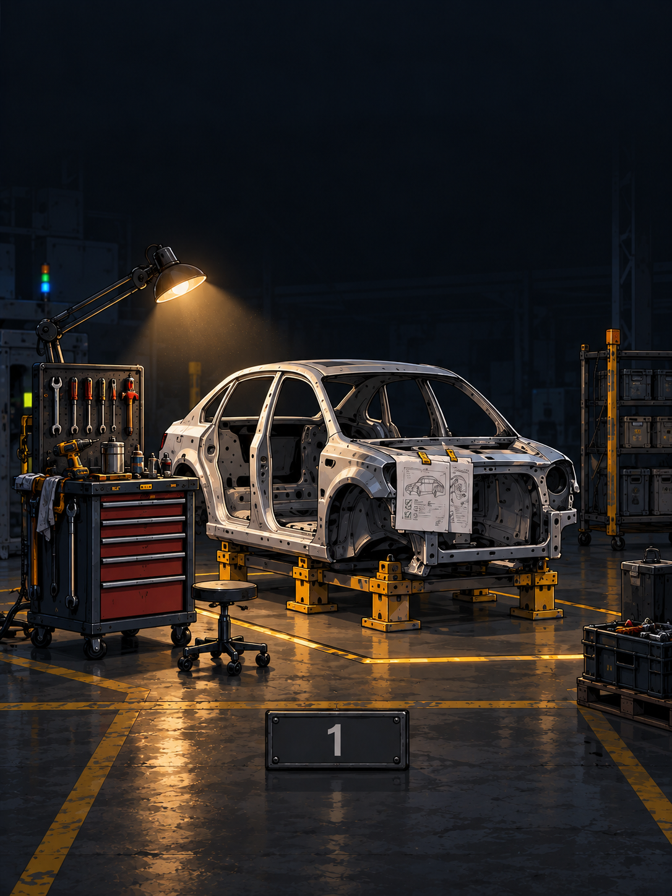
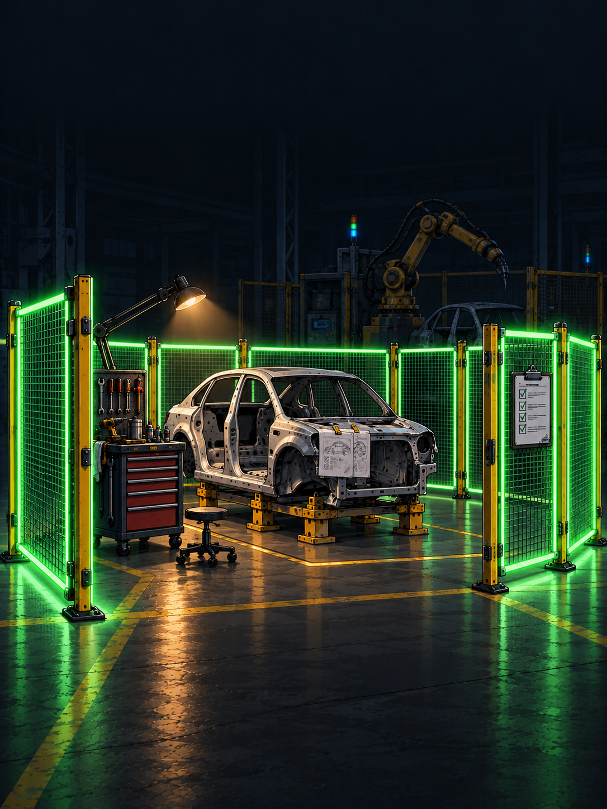
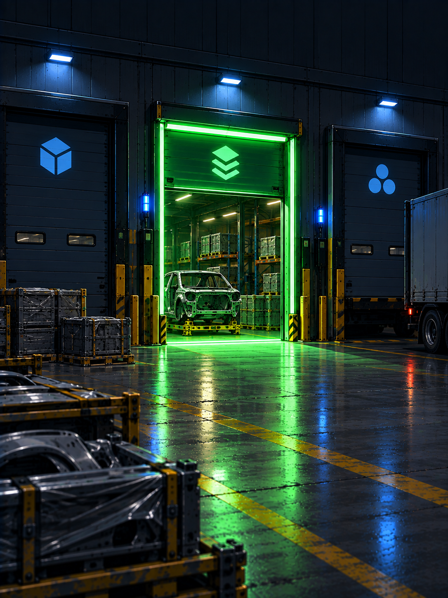
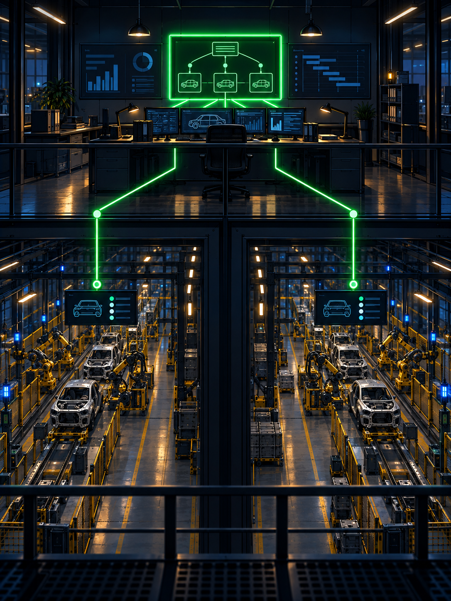
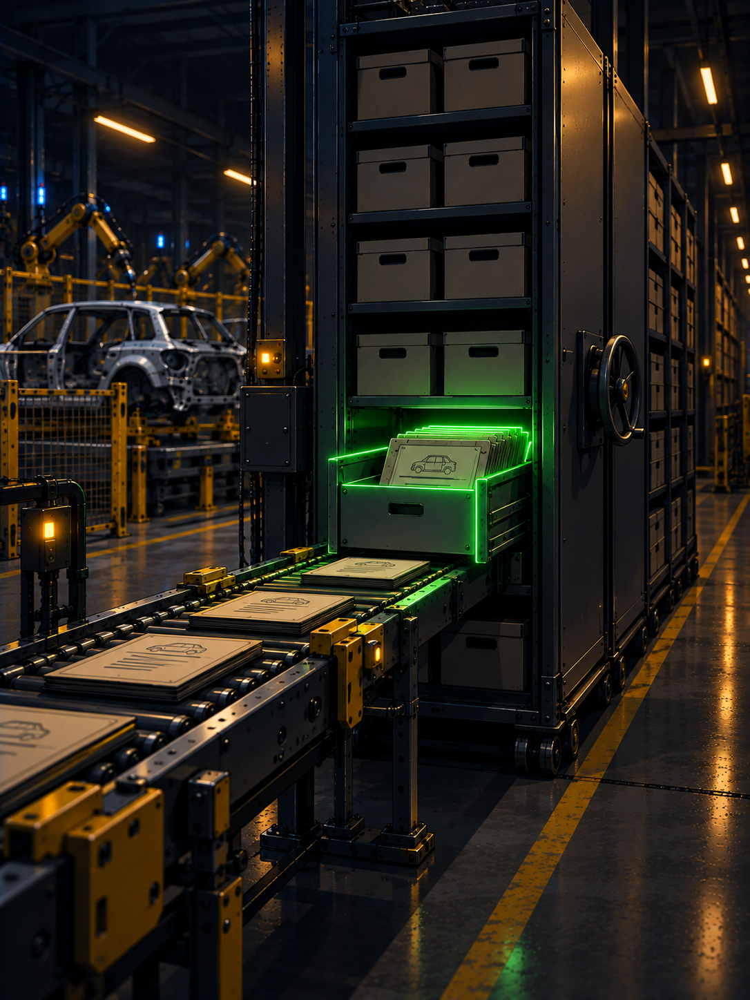
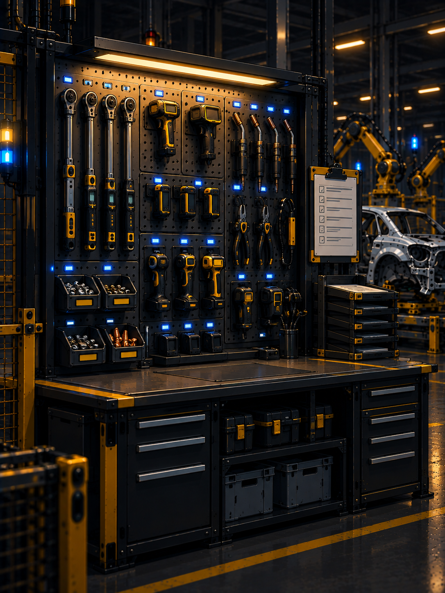

<style>
@import url('https://fonts.googleapis.com/css2?family=Fira+Code:wght@400;500;700&family=Inter:wght@400;600;700&display=swap');

:root {
  --color-background: #101216;
  --color-foreground: #d8d6d0;
  --color-heading: #f5b301;
  --color-accent: #f5b301;
  --color-go: #35d07f;
  --color-code-bg: #1a1d22;
  --color-border: #3a3d44;
  --font-default: 'Inter', sans-serif;
  --font-code: 'Fira Code', 'Consolas', 'Monaco', monospace;
}

section {
  background-color: var(--color-background);
  color: var(--color-foreground);
  font-family: 'Inter', sans-serif;
  font-size: 22px;
  padding: 52px 56px;
  border-left: 4px solid var(--color-accent);
}

h1, h2, h3 {
  font-family: 'Fira Code', monospace;
  font-weight: 700;
  color: var(--color-heading);
}

h1 { font-size: 46px; }
h1::before { content: '# '; color: var(--color-accent); }
h2 { font-size: 34px; margin-bottom: 28px; padding-bottom: 10px; border-bottom: 2px solid var(--color-border); }
h2::before { content: '## '; color: var(--color-accent); }

ul, ol { padding-left: 30px; }
li { margin-bottom: 8px; }
li::marker { color: var(--color-accent); }
strong { color: var(--color-accent); }

pre {
  background-color: var(--color-code-bg);
  border: 1px solid var(--color-border);
  border-radius: 6px;
  padding: 14px 16px;
  font-size: 15px;
  line-height: 1.5;
}
code {
  background-color: var(--color-code-bg);
  color: var(--color-accent);
  padding: 2px 6px;
  border-radius: 3px;
  font-family: 'Fira Code', monospace;
  font-size: 0.88em;
}
pre code { background-color: transparent; padding: 0; color: var(--color-foreground); }

/* highlight.js tokens - github-dark palette for the dark stage */
.hljs-attr { color: #79c0ff; }
.hljs-string, .hljs-string .hljs-subst { color: #a5d6ff; }
.hljs-bullet, .hljs-number, .hljs-literal { color: #79c0ff; }
.hljs-keyword, .hljs-selector-tag { color: #ff7b72; }
.hljs-comment, .hljs-quote { color: #8b949e; font-style: italic; }
.hljs-title, .hljs-section, .hljs-name { color: #7ee787; }
.hljs-variable, .hljs-template-variable { color: #ffa657; }
.hljs-type, .hljs-built_in { color: #ffa657; }
.hljs-symbol, .hljs-meta { color: #79c0ff; }
.hljs-addition { color: #aff5b4; }
.hljs-deletion { color: #ffdcd7; }
.hljs-emphasis { font-style: italic; }

table { font-size: 17px; border-collapse: collapse; }
th {
  background-color: var(--color-code-bg);
  color: var(--color-accent);
  border: 1px solid var(--color-border);
  padding: 8px 14px;
  font-family: 'Fira Code', monospace;
}
td {
  border: 1px solid var(--color-border);
  padding: 8px 14px;
  color: var(--color-foreground);
}
tr:nth-child(even) td { background-color: rgba(22, 27, 34, 0.6); }
blockquote { font-size: 21px; border-left: 3px solid var(--color-accent); }

header { font-size: 14px; color: #8b949e; font-family: 'Fira Code', monospace; }
header strong { color: #f5b301; }

footer { font-size: 13px; color: #6e7681; font-family: 'Fira Code', monospace; }
footer::before { content: '// '; color: var(--color-accent); }

section.title-slide {
  background: linear-gradient(135deg, #17181c 0%, #2b2e34 60%, #17181c 100%);
  justify-content: center;
}
section.title h1 { font-size: 34px; text-shadow: 0 2px 14px rgba(0,0,0,0.95); }
section.title h1::before { content: none; }
section.title h2 { font-size: 23px; border-bottom: none; text-shadow: 0 2px 10px rgba(0,0,0,0.95); }
section.title h2::before { content: none; }
section.title { border-left: none; display: flex; flex-direction: column; justify-content: flex-start; padding: 64px 56px 56px; }
section.title h1 { margin-top: 0; }
section.part-model,
section.part-upgrades,
section.part-run,
section.title-slide {
  --h1-color: #fff;
  color: white;
}
section.part-model h1, section.part-upgrades h1, section.part-run h1 { color: #fff; }
section.part-model { background: linear-gradient(135deg, #1c1e22 0%, #3a3e45 100%); }
section.part-upgrades { background: linear-gradient(135deg, #4a3408 0%, #8a6410 100%); }
section.part-run { background: linear-gradient(135deg, #0e2e1f 0%, #1d5c3a 100%); }
</style>

<!-- footer: "" -->
<!-- _header: "" -->
<!-- _class: title -->


# Delivering more robust code safely using custom skills

## A personal experiment in overengineering the Superpowers skill

<!--
Talk track:

-->

---

<!-- header: "" -->

# What is this talk really about

1. **Structure and best practices** over free form discussion
2. **Agentic safety\* and autonomy** towards a goal
3. **High feature throughput** in local development

<!--
Talk track:

-->

---

<!-- _class: lead title-slide -->
<!-- header: "" -->
<!-- footer: "" -->

# Agenda

### Part 1: From "vanilla" via superpowers to super-fr
Incremental improvements, paid in frustration and tokens

### Part 2: Demo
Where it pays out

### Part 3: Run it yourself
Your first `/fr-goal`

<!--
Talk track:

-->

---

<!-- _class: lead title-slide -->
<!-- header: "" -->
<!-- footer: "" -->

# Stats

### 
1000+ merged PRs across 15 repos, one annotated body


<!--
Talk track:
- Shapes first, upgrades second. The model gives each upgrade somewhere to hang. Then we get practical.
- Part 1 is the only abstract part. Survive it and the rest is stories plus commands.
-->

---

<!-- _header: "" -->
<!-- _class: lead part-model -->

# Stage 1: vanilla prompts

**One checkout, one chat, no artifacts - fast until the second feature**

<!--
Talk track:
- Station one. You prompt, the model plans in chat, codes in your checkout, you eyeball it and push.
- Nothing here is wrong at small scale. Everything here breaks at the second concurrent feature: the plan lives in chat history, the half-done state lives in your checkout, done means it looked right.
- Keep this slide in mind. Every later stage is a response to something on it.
-->

---

<!-- header: "**Stages** > Upgrades > Run it" -->

## Vanilla cycle



```
prompt ──▶ plan in chat ──▶ code in base ──▶ eyeball ──▶ push?
```

- Outcome in, approach out: explores, asks on real decisions
- Three modes: interactive, plan-to-approve, autopilot
- Validates what you name, reruns on failure
- **No plan artifact**: conventions restated every single task
- Human owns merge, secrets, production impact

<!--
Talk track:
- This is the usual case, and it is already smart. Copilot plus Terra is a strong general teammate: outcome-oriented prompts, repository exploration, multi-file edits, terminal validation, three session modes up to full autopilot.
- Two honest limits, straight from its own description. One: no plan artifact survives the session, so every task restates conventions, checks, and constraints from scratch. Repetition is the tax.
- Two: it validates what you name and ships what you approve. Teammate, not owner. The merge, the secrets, the production judgment stay human, and nothing on disk records the journey.
- This slide is the baseline the next two stations upgrade.
-->

---

<!-- header: "**Stages** > Upgrades > Run it" -->

## Superpowers run


```
idea ──▶ brainstorm ──▶ write plan ──▶ worktree ──▶ execute+TDD ──▶ verify→review→fix ──▶ finish
```

- Idea in, approved spec out: no code before sign-off
- Spec in, zero-context plan out, then two executor options
- Iron laws inside: failing test first, evidence before any claim
- Review is double-sided, finishing gates on green with 4 options
- **Gaps remain**: one markdown plan, session memory, opt-in fence

<!--
Talk track:
- Station two, the serious version of station one. Brainstorming ends in a spec markdown and refuses code until the design is approved, with a reviewer loop on top. Writing-plans turns it into steps a fresh session could execute, then offers subagent-driven or inline execution.
- Inside: test-driven-development runs red-green-refactor, verification-before-completion forbids completion claims without a fresh full-command run. Reviewing is double-sided, requesting dispatches SHA-scoped reviews, receiving bans performative agreement. Finishing verifies tests first, offers exactly four options, cleans up the worktree.
- The honest limit, and it is the whole rest of this talk: the plan is one markdown file no tool can read, progress lives in session memory, and the worktree fence is opt-in per task. Everything after this slide is one of those three growing up.
-->

---

<!-- header: "**Stages** > Upgrades > Run it" -->

## fr-goal run


```
brainstorm ──▶ spec-review ──▶ plan ──▶ plan-review ──▶ implement+review ×N ──▶ deliver
```

- Shape is data: `kind: cli` runs, `kind: agent` briefs, `gate` stops
- Run file on the branch, failed step holds the cursor
- Workspace first: worktree plus container, then the run

<!--
Talk track:
- Station three. Same silhouette as station two, new species: the pipeline is a yaml manifest that validates, the cursor is a file on your branch that survives compaction, and isolation is a mandatory cell, not a sidecar fence.
- Cli steps execute with exit code as verdict. Agent steps print a brief, you work, you resolve. The single operator gate is the batched question round.
- Everything after this slide is one super-fr addition presented as the upgrade it is: what superpowers lacked, what failure paid for it, what it costs.
-->

---

<!-- header: "Stages > **Upgrades** > Run it" -->

## Feature velocity

- **1000+ merged PRs** across **15 repos**, May to September 2026
- Roughly two thirds of sampled bodies carry pipeline markers
- Example: `super-fr#449` — Why, spec/plan/journal links, What ships

> Acceptance rows, verification log, journaled deviations, open findings

<!--
Talk track:
- Street cred, honestly labeled. A thousand merged pull requests in four months across fifteen repos of one org, and about two thirds of the bodies I sampled reference the spec, the plan, or the journal.
- Pull request 449 is the anatomy slide: Why, links to spec plan journal, what ships, acceptance rows all flipped to ci, verification output, deviations from the plan with journal hashes, open findings that are follow-ups not blockers, and an operator rollout phase.
- Caveat I will not skip: not every one of those thousand ran this pipeline. The claim is that the org ships at this rate with this workflow available, and the bodies show the discipline spreading.
-->

---

<!-- _header: "" -->
<!-- _class: lead part-upgrades -->

# Upgrades, each justified

**What superpowers lacked, the failure that paid, what it costs**

<!--
Talk track:
- The evolutions showed the what. These next slides show the why, one upgrade at a time. Each follows the same shape: what superpowers lacked, the failure that paid for the addition, what it costs you.
-->

---

<!-- header: "Stages > **Upgrades** > Run it" -->

## Isolation



- Sidecar fence became a mandatory cell: worktree plus container
- Secrets stay outside, least-privilege profile by default
- Dead brainstorms leave the base checkout pristine

<!--
Talk track:
- Upgrade one, the cage. Superpowers had using-git-worktrees as an opt-in sidecar. Here isolation is mandatory: worktree plus devcontainer before anything else, every command through the exec bridge, secrets host-side per profile.
- A brainstorm that dies leaves the base pristine. That sentence alone is worth the profile-setup interview on first run.
-->

---

<!-- header: "Stages > **Upgrades** > Run it" -->

## Pipeline as data


```yaml
- id: brainstorm
  kind: agent
  skill: super-fr:fr-brainstorming
  gate: operator
  emits: [spec]
- id: plan-review
  kind: cli
  run: fr plan self-review {{ artifacts.plan }}
```

- `kind: cli` runs, exit code is the verdict
- `kind: agent` briefs, you work, then `fr run resolve`
- `gate: operator` stops until a person answers

<!--
Talk track:
- This is a real fragment of fr-goal.yaml. A shape is an ordered list of steps plus what each step needs and emits.
- Cli steps are deterministic, nobody interprets them. Agent steps never execute inside fr, it prints a brief, you do the work, you resolve. The gate is the one promised stop.
- Consequence: the engine is a plain program with no path to a language model. Every judgment happens on the far side of a visible handoff.
- Full file: plugins/super-fr/workflows/fr-goal.yaml, six steps plus two grouped children under implement.
-->

---

<!-- header: "Stages > **Upgrades** > Run it" -->

## Run cursor


```bash
fr run advance <id>   # cli runs, agent briefs
fr run resolve <id> --step <s> --state done
```

- Run file rides the branch into the pull request
- Failed step holds position, nothing slides past
- A run is born in its workspace, never in the base

<!--
Talk track:
- Upgrade three, the conveyor. Superpowers kept position in chat and checkboxes. The run file is a cursor on your branch: advance runs cli steps and briefs agent ones, resolve is the only way past running.
- Start validates the shape before provisioning anything, then writes the run inside the workspace. Failure holds the cursor instead of sliding past it.
-->

---

<!-- header: "Stages > **Upgrades** > Run it" -->

## One batched Q&A


- Agent studies the code first, then asks once, max four
- Recommended options first, unanswered means stop
- Spec and plan reviews become fix passes, not approvals

<!--
Talk track:
- Before: decisions arrived one at a time across days, and anything unanswered got guessed. So exploration first, then a single batched round. Four questions max forces the agent to rank what is truly operator-owned.
- Unanswered is a stop, never a default. After that the agent owes you no more approvals, it owes you fix passes.
- Post-merge test plan and model-per-tier questions ride the same round when relevant.
-->

---

<!-- header: "Stages > **Upgrades** > Run it" -->

## Acceptance matrix


| Status | Meaning |
|---|---|
| `not-implemented` | Claimed, nothing yet |
| `skipped` | Proven once, not in CI |
| `ci` / `scheduled` | Automated, cannot drift |
| `failing` | Red by design, blocks CI |

- Rows born at brainstorm, one-line defense each
- Phases link rows, self-review enforces it

<!--
Talk track:
- Before: suite green, feature not doing the thing. So acceptance rows in docs/acceptance/matrix.yaml, one operator-can-X per row, flipped up only with test evidence.
- Rows are presented with defenses at brainstorm close. Silent creation is not agreement on scope.
- The plan links phases to rows and the gate errors on unlinked test-plan specs. Debt stays visible in the pull request, embarrassing by design.
-->

---

<!-- header: "Stages > **Upgrades** > Run it" -->

## Plan folders, labeled manual work


- Folder per plan: `_meta.yaml`, `_prose.md`, one file per phase
- Step ids `P1.T1.S1`, dependencies explicit
- `fr plan self-review`: cycles, hidden manual work, bad links


<!--
Talk track:
- Before: the single markdown plan, unmergeable, position kept in the model's head. Per-phase files also kill merge conflicts.
- Self-review runs before any token burns on implementation: dependency cycles, manual work hiding in agentic phases, unknown acceptance ids.
- Manual phases back-load by default, the pull request ships them unimplemented and you push to the same branch. Front-load only when agentic work genuinely depends.
-->

---

<!-- header: "Stages > **Upgrades** > Run it" -->

## Phase executors, journal handoff


- One executor per phase, briefed from the journal
- Failing test, implement, refactor - the traveler gets stamped
- Tier-matched tools: light joints, light robots


<!--
Talk track:
- Upgrade seven, the robots. Superpowers already had subagent-driven execution and the iron TDD loop. What changed is the handoff: pickup plus spec plus journal render, discoveries stamped per phase, acceptance rows flipped only on evidence.
- Tiers route the model per phase, and the one hard rule is enforced by a hook: the executor never gets its own worktree, because a second worktree cannot see the spec and the run looks healthy while doing nothing.
-->

---

<!-- header: "Stages > **Upgrades** > Run it" -->

## Review loop, guarded delivery


- Per-phase review, findings fixed with tests or formally refuted
- Draft PR first, ready only when green, never self-merged
- Verify arrival on main before archive and teardown


<!--
Talk track:
- Two lessons in one slide. Fixes pushed after a premature merge landed on dead branches, so now draft first and the push guard refuses merged-branch pushes.
- And the healthy-looking run that did nothing: a phase executor in a second worktree cut from main cannot see the spec, so the no-worktree carve-out is enforced by a hook, not by prose.
- Review findings are fixed with tests or refuted with reasoning, recorded open, fixed, or refuted. The pull request body is rendered from that list.
-->

---

<!-- header: "Stages > **Upgrades** > Run it" -->

## PR bodies from the journal


- Bodies rendered from the journal, not written freehand
- Findings, refutations, manual work, test plan, debt - all aboard
- Comments are explicit mutations, drift rewrites the body


<!--
Talk track:
- Upgrade nine, the paperwork. A vanilla agent writes whatever summary occurs to it. Superpowers fixed the template. Here the body is rendered from durable lists: findings and refutations, manual phases marked unimplemented, the test plan verbatim, acceptance debt with defenses.
- Tracking issues get the same treatment: bodies re-rendered on drift, comments only as explicit mutations like dispatched-in-error. Nothing narrates itself.
-->

---

<!-- header: "Stages > **Upgrades** > Run it" -->

## Git backends, harness ports



- `gh`, `glab`, `tea` behind one backend switch, dry-run by default
- Reachability gate: runners check out main, so the plan must be on it
- Claude, OpenCode, Hermes drive the same `fr run` surface


<!--
Talk track:
- Upgrade ten, the docks. One backend switch instead of a rewrite per forge, dry-run default so every mutation previews first, labels projecting issue state.
- Harnesses are the sister plants: Claude is the reference with full hook surface, OpenCode ports the edit guard with a documented bash gap, Hermes carries the brief in delegate context. Same CLI everywhere.
-->

---

<!-- header: "Stages > **Upgrades** > Run it" -->

## Multi-repo specs



- Coordinating spec names one plan per repo (`owner/repo:path`)
- This line builds one repo, each other repo gets its own agent
- Cross-repo deps live in the spec and PR order, never in wiring
- Remote phases readable from here, journals stay home


<!--
Talk track:
- Upgrade eleven, the group order. A feature touching three repos gets one coordinating spec with an Implementation Plans table, and one plan, branch, and pull request per repo.
- This session owns its repo outright. Each other repo gets a dispatched agent with its own worktree running the same pipeline from planning onward. Dependencies between plants live in the spec and the merge order, never in a phase's local wiring.
- Read-only reach extends here too: remote phase files resolve for status, while each repo's journal stays in its own building. Dispatch of cross-repo phases is explicitly not yet wired, and the tool says so instead of pretending.
-->

---

<!-- header: "Stages > **Upgrades** > Run it" -->

## Archiving



- Gated mover: only complete phases leave the work queue
- Plans, journals, runs file together under `implemented/`
- Content-matched GC reaps merged workspaces, never open ones


<!--
Talk track:
- Upgrade twelve, the vault. At this org's volume the plans folder is a work queue, not history. Archive refuses incomplete work and dirty trees, moves plan plus journal plus run as one unit, sweeps fully-implemented specs.
- Garbage collection is content-matched: merged workspaces reap, open ones stay, unattended runners never leak. Done means archived.
-->

---

<!-- _header: "" -->
<!-- _class: lead part-run -->

# Run it

**From zero to first reviewed pull request**

<!--
Talk track:
- Theory over. This part is a checklist you can follow Monday. Four moves plus pointers.
-->

---

<!-- header: "Stages > Upgrades > **Run it**" -->

## First goal in four moves



```bash
curl -fsSL .../bootstrap.sh | bash   # install fr plus plugins
fr-init                               # interview, scaffold a profile
/fr-goal <what you want>              # answer once, then watch
fr acceptance status                  # flip rows as evidence lands
```

- Standalone when small: `fr-brainstorming`, `fr-debugging`, `fr-plan`
- Custom pipeline: your own `workflows/<name>.yaml`, validated by check
- Scale out: `fr apply --to <runner>` fans merged phases to agents

<!--
Talk track:
- Move one installs everything and wires the harness you have. Move two is the only interview in the system and it exists because isolation without a profile is a hard stop, not a degraded mode.
- Move three is the whole talk in one command. Answer the round, then the shape drives.
- Move four keeps you honest. Standalone skills cover the small jobs. A custom shape is a yaml file plus check. Dispatch is for merged plans with per-phase pull requests.
- Repos resolve runners and git hosts the same way everywhere, one CLI surface per harness.
-->

---

<!-- header: "Stages > Upgrades > **Run it**" -->

## Takeaways


1. **Pipeline is data** - shapes validate, resolve, and re-run
2. **Progress is a file** - cursor on the branch, failure holds still
3. **Work is isolated** - worktree plus container, no fallback
4. **Done means proven** - acceptance rows plus review findings

Next: the test track - one annotated fr-goal run, narrated live

<!--
Talk track:
- Four sentences to carry out. If you remember nothing else: data, file, isolation, proof.
- My position, stated plainly: the ceremony earns its keep. Each row of ceremony exists because the un-ceremonied version failed on a real feature.
- Half 2 is the test track: one annotated fr-goal run, narrated over the recording. No full comparison - the hour is better spent on one run you can see clearly.
- Thank you. Questions, then your first goal whenever you are ready.
-->

---

<!-- _header: "" -->
<!-- _class: lead part-run -->

# Deep dives

**Backup slides - jump by number, not part of the linear flow**

---

<!-- header: "Deep dives" -->

## D1 - isolation commands

```bash
fr isolation up --branch feat/thing --profile dev
fr isolation exec --branch feat/thing -- uv run pytest -q
fr isolation status
fr isolation down --branch feat/thing
```

- Worktree plus container, secrets host-side per profile
- Refuses teardown while the pull request is open

---

<!-- header: "Deep dives" -->

## D2 - shape fragment, real file

```yaml
workflow: fr-goal
schema: 1
unit: run
requires: [git, tests, scm]
steps:
  - id: brainstorm
    kind: agent
    skill: super-fr:fr-brainstorming
    gate: operator
    emits: [spec, journal:spec]
```

- Source: `plugins/super-fr/workflows/fr-goal.yaml`
- `implement` is a grouped `for_each`, review enforced per phase

---

<!-- header: "Deep dives" -->

## D3 - run file, real run

```yaml
run: 2026-09-09-feat-presentation-showdown
workflow: presentation-showdown@1
cursor: record-compare
steps:
  outline: {state: done}
  experiment-design: {state: done}
  design-review: {state: done, exit: 0}
  instrument: {state: done}
  record-compare: {state: pending}
```

- This deck's own run, committed on its branch
- Failed steps hold the cursor, pending steps wait

---

<!-- header: "Deep dives" -->

## D4 - answering the gate

```bash
fr run resolve 2026-09-09-feat-presentation-showdown \
  --step outline --state done \
  --emitted spec=docs/superpowers/specs/2026-09-09-design.md
```

- Emitted paths must exist and be repo-relative
- Unanswered gates stop the run, never default it

---

<!-- header: "Deep dives" -->

## D5 - matrix row anatomy

```yaml
# status: ci | scheduled | skipped | not-implemented | failing
rows:
  - id: session-workspace-binding
    capability: Isolation
    acceptance: bound workspace shown in status line
    origin: [super-fr:docs/superpowers/specs/2026-09-04-design.md]
    levels: {int: [super-fr:tests/int/test_x.py]}
    status: ci
```

- Schema from `docs/acceptance/matrix.yaml`, rows appended by CLI only

---

<!-- header: "Deep dives" -->

## D6 - phase file, real plan

```yaml
schema_version: 2
phase:
  number: 2
  title: Experiment protocol and instrumentation
  tag: agentic
  depends_on: [1]
tasks:
  - number: 1
    title: Freeze protocol and capture harness
    steps:
      - {id: P2.T1.S1, text: Write seed prompt template}
```

- One file per phase, explicit dependencies, tickable steps

---

<!-- header: "Deep dives" -->

## D7 - journal entry, real run

```markdown
<!-- fr:journal kind=decision scope=spec id=293fbe90d058 -->
### 293fbe90d058 - decision - Outline gate answered

Model: OpenAI Terra default effort both runs.
Demo: details redacted (not accessed; not cleared).
```

- Machine-tagged entries, rendered raw into briefs and bodies

---

<!-- header: "Deep dives" -->

## D8 - acceptance evidence, PR 449

```text
Six rows born with the spec, all now ci:
session-workspace-binding, statusline-shows-bound-workspace, ...
fr acceptance check: 99 rows OK.
pytest: 2685 passed, 84 skipped. ruff clean.
```

- Source: `derio-net/super-fr#449`, the annotated example

---

<!-- header: "Deep dives" -->

## D9 - deviations, PR 449

```text
Deviations from the plan text (all journaled):
- down runs detach_all after teardown, not before (7656ab55c62c)
- Acceptance levels are unit|api|int|ui (62c39ba6fb84)
Open findings (follow-ups, not blockers):
- d028f3cc945a Hermes has no session bind transport yet.
```

- Drift disclosed with hashes, never silently absorbed

---

<!-- header: "Deep dives" -->

## D10 - docks in two commands

```bash
fr apply docs/superpowers/plans/2026-09-09-x          # dry-run preview
fr apply docs/superpowers/plans/2026-09-09-x --to vk --yes
```

- Backend resolves per repo: config key, remote host, default
- Labels: `fr:ready` to `fr:pr-ready`, `manual` never routed

---

<!-- header: "Deep dives" -->

## D11 - cross-repo table, real spec

```markdown
| Plan | Repo | File | Depends on |
|---|---|---|---|
| 2026-09-09-presentation-showdown | `derio-net/super-fr` | `2026-09-09-presentation-showdown` | — |
```

- Cross-repo form: `owner/repo:path`, one plan per repo

---

<!-- header: "Deep dives" -->

## D12 - the vault, real contents

```text
docs/superpowers/implemented/
  audits/ journals/ plans/ specs/
  plans/2026-04-12-vk-cli-p2-dispatch ...
```

- Gated mover only: complete phases, clean tree, one unit

---

<!-- header: "Deep dives" -->

## D13 - spec, superpowers vs super-fr

```text
superpowers: design doc + commit, reviewer loop x3, user reads file
super-fr adds: Test Plan section (post-merge, operator-driven),
  Implementation Plans table (one row per repo),
  acceptance rows born here with one-line defenses
```

- Same path, same name form - the additions are sections, not files
- Test Plan agreed in the batched Q&A, driven together after merge

---

<!-- header: "Deep dives" -->

## D14 - plan, superpowers vs super-fr

```text
superpowers: # Feature Implementation Plan, checkbox steps,
  2-5 minute granularity, reviewer loop, then handoff choice
super-fr: folder (_meta.yaml, _prose.md, NN.yaml per phase),
  P1.T1.S1 ids, tier + acceptance per phase, self-review gate
```

- Checkboxes a session ticks became state a CLI validates
- Manual phases labeled, cross-repo refs in canonical form
