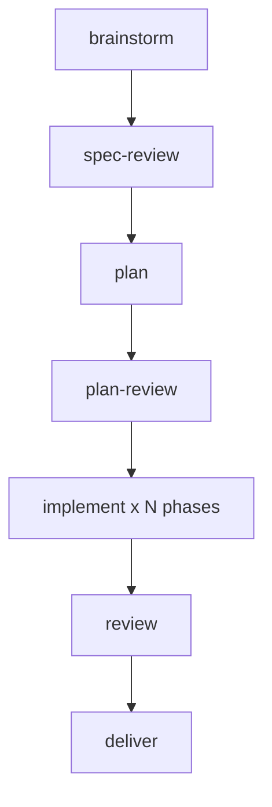

<style>
@import url('https://fonts.googleapis.com/css2?family=Fira+Code:wght@400;500;700&family=Inter:wght@400;600;700&display=swap');

:root {
  --color-background: #0d1117;
  --color-foreground: #c9d1d9;
  --color-heading: #58a6ff;
  --color-accent: #7ee787;
  --color-code-bg: #161b22;
  --color-border: #30363d;
}

section {
  background-color: var(--color-background);
  color: var(--color-foreground);
  font-family: 'Inter', sans-serif;
  font-size: 22px;
  padding: 52px 56px;
  border-left: 4px solid var(--color-accent);
}

h1, h2, h3 {
  font-family: 'Fira Code', monospace;
  font-weight: 700;
  color: var(--color-heading);
}

h1 { font-size: 46px; }
h1::before { content: '# '; color: var(--color-accent); }
h2 { font-size: 34px; margin-bottom: 28px; padding-bottom: 10px; border-bottom: 2px solid var(--color-border); }
h2::before { content: '## '; color: var(--color-accent); }

ul, ol { padding-left: 30px; }
li { margin-bottom: 8px; }
li::marker { color: var(--color-accent); }
strong { color: var(--color-accent); }

pre {
  background-color: var(--color-code-bg);
  border: 1px solid var(--color-border);
  border-radius: 6px;
  padding: 14px 16px;
  font-size: 15px;
  line-height: 1.5;
}
code {
  background-color: var(--color-code-bg);
  color: var(--color-accent);
  padding: 2px 6px;
  border-radius: 3px;
  font-family: 'Fira Code', monospace;
  font-size: 0.88em;
}
pre code { background-color: transparent; padding: 0; color: var(--color-foreground); }

table { font-size: 17px; }
blockquote { font-size: 21px; border-left: 3px solid var(--color-accent); }

header { font-size: 14px; color: #8b949e; font-family: 'Fira Code', monospace; }
header strong { color: #58a6ff; }

footer { font-size: 13px; color: #6e7681; font-family: 'Fira Code', monospace; }
footer::before { content: '// '; color: var(--color-accent); }

section.title-slide {
  background: linear-gradient(135deg, #0f172a 0%, #1e293b 50%, #0f172a 100%);
  justify-content: center;
}
section.part-model,
section.part-scars,
section.part-run,
section.title-slide {
  --h1-color: #fff;
  color: white;
}
section.part-model h1, section.part-scars h1, section.part-run h1 { color: #fff; }
section.part-model { background: linear-gradient(135deg, #1e3a5f 0%, #2d5a8e 100%); }
section.part-scars { background: linear-gradient(135deg, #064e3b 0%, #047857 100%); }
section.part-run { background: linear-gradient(135deg, #3d1e5c 0%, #5a2d8e 100%); }
</style>

<!-- _class: lead title-slide -->
<!-- footer: "" -->

# super-fr: from prompt to reviewed PR

## Half 1 - shapes, scars, and your first run

**Audience**: daily AI users, new to fr
**Goal**: you leave ready to run it
**When**: September 2026

<!--
Talk track:
- Two halves today. Half 1 is yours to use on Monday: the mental model, why each piece exists, then the exact path to a first run.
- Half 2, later: the same feature built twice, fr-goal versus vanilla, measured. I believe the ceremony pays. The numbers get a vote too.
- No superpowers knowledge assumed. Everything is on these slides or one link away.
-->

---

<!-- header: "" -->

# Questions this talk answers

1. **What is the pipeline** - where does each step live and who runs it
2. **Why so many steps** - which real failure each ceremony prevents
3. **How do I start** - profiles, first goal, acceptance rows, next moves

<!--
Talk track:
- Three promises. One: a mental model you can hold in your head, the shape and the cursor.
- Two: honesty about cost. Every mechanism here slowed something down to prevent something worse. You get the failure stories, not just the features.
- Three: runnable. Install, profile interview, first goal, acceptance rows. If the wifi holds there may be a live command or two.
-->

---

<!-- _class: lead title-slide -->
<!-- header: "" -->
<!-- footer: "" -->

# Agenda

### Part 1: the mental model
Shapes, cursor, isolation - the three ideas everything hangs on

### Part 2: scars as proof
Five failures, five mechanisms, each earned the hard way

### Part 3: run it
Your first goal, end to end, plus where to go next

<!--
Talk track:
- Shapes first, scars second. The model gives scars somewhere to hang. Then we get practical.
- Part 1 is the only abstract part. Survive it and the rest is stories plus commands.
-->

---

<!-- _header: "" -->
<!-- _class: lead part-model -->

# Part 1: the mental model

**Shapes, cursor, isolation - hold these three and the rest clicks**

<!--
Talk track:
- Three ideas. The pipeline is a data file. Progress is a file on your branch. Work happens outside your checkout. That is nearly the whole talk.
-->

---

<!-- header: "**Mental model** > Scars > Run it" -->

## Pipeline as data

```yaml
- id: brainstorm
  kind: agent
  skill: super-fr:fr-brainstorming
  gate: operator
  emits: [spec]
- id: plan-review
  kind: cli
  run: fr plan self-review {{ artifacts.plan }}
```

- `kind: cli` runs, exit code is the verdict
- `kind: agent` briefs, you work, then `fr run resolve`
- `gate: operator` stops until a person answers

<!--
Talk track:
- This is a real fragment of fr-goal.yaml. A shape is an ordered list of steps plus what each step needs and emits.
- Cli steps are deterministic, nobody interprets them. Agent steps never execute inside fr, it prints a brief, you do the work, you resolve. The gate is the one promised stop.
- Consequence: the engine is a plain program with no path to a language model. Every judgment happens on the far side of a visible handoff.
- Full file: plugins/super-fr/workflows/fr-goal.yaml, six steps plus two grouped children under implement.
-->

---

<!-- header: "**Mental model** > Scars > Run it" -->

## Shape graph



- One operator gate: the batched questions
- One deterministic gate: `plan self-review`
- Fan-out: one executor per phase, then review

<!--
Talk track:
- Walk the graph left to right. Brainstorm ends in one question round, that is the single operator gate on the happy path.
- Plan-review is the deterministic gate, a command whose exit code decides. Implement fans out per phase, each executor briefed from the journal.
- Review then deliver close it. Draft pull request first, marked ready only when green. Merge is always yours.
-->

---

<!-- header: "**Mental model** > Scars > Run it" -->

## Runs live in their workspace

```bash
fr run start fr-goal --branch feat/thing
fr run advance <run-id>   # cli runs, agent briefs
fr run resolve <run-id> --step <id> --state done
```

- Run file lives on the branch, rides into the PR
- Failed step holds the cursor, nothing slides past
- Workspace first: worktree plus devcontainer, then the run

<!--
Talk track:
- Start validates the shape before provisioning anything, then creates the worktree and container, then writes the run file inside the workspace. A run is born where it works.
- Advance on a cli step runs it. On an agent step it prints the brief and waits. Resolve is the only way past running.
- Isolation in one breath: reads and edits on the host worktree, every command through fr isolation exec, secrets host-side per profile. No unisolated fallback, documented escapes only.
-->

---

<!-- _header: "" -->
<!-- _class: lead part-scars -->

# Part 2: scars as proof

**Each mechanism below was a failure first**

<!--
Talk track:
- Origin story, fast. I picked superpowers as the base because it was the leanest loop. Then real features kept breaking in the same five ways. Each scar below is one of those ways plus what it became.
-->

---

<!-- header: "Mental model > **Scars** > Run it" -->

## One question round

- Agent studies the code first, then asks once, max four
- Recommended options first, unanswered means stop
- Spec and plan reviews become fix passes, not approvals

> Dripped interruptions and guessed scope die here

<!--
Talk track:
- Scar: decisions arrived one at a time across days, and anything unanswered got guessed. So exploration first, then a single batched round. Four questions max forces the agent to rank what is truly operator-owned.
- Unanswered is a stop, never a default. After that the agent owes you no more approvals, it owes you fix passes.
- Post-merge test plan and model-per-tier questions ride the same round when relevant.
-->

---

<!-- header: "Mental model > **Scars** > Run it" -->

## Proof, not promises

| Status | Meaning |
|---|---|
| `not-implemented` | Claimed, nothing yet |
| `skipped` | Proven once, not in CI |
| `ci` / `scheduled` | Automated, cannot drift |
| `failing` | Red by design, blocks CI |

- Rows born at brainstorm, one-line defense each
- Phases link rows, self-review enforces it

<!--
Talk track:
- Scar: suite green, feature not doing the thing. So acceptance rows in docs/acceptance/matrix.yaml, one operator-can-X per row, flipped up only with test evidence.
- Rows are presented with defenses at brainstorm close. Silent creation is not agreement on scope.
- The plan links phases to rows and the gate errors on unlinked test-plan specs. Debt stays visible in the pull request, embarrassing by design.
-->

---

<!-- header: "Mental model > **Scars** > Run it" -->

## Plans a tool can read

- Folder per plan: `_meta.yaml`, `_prose.md`, one file per phase
- Step ids `P1.T1.S1`, dependencies explicit
- `fr plan self-review`: cycles, hidden manual work, bad links

> Manual work ships labeled `[manual]`, never smuggled in

<!--
Talk track:
- Scar: the single markdown plan, unmergeable, position kept in the model's head. Per-phase files also kill merge conflicts.
- Self-review runs before any token burns on implementation: dependency cycles, manual work hiding in agentic phases, unknown acceptance ids.
- Manual phases back-load by default, the pull request ships them unimplemented and you push to the same branch. Front-load only when agentic work genuinely depends.
-->

---

<!-- header: "Mental model > **Scars** > Run it" -->

## Loop until reviewed

- One executor per phase, briefed from the journal
- Failing test, implement, refactor, per-phase review
- Draft PR first, ready only when green

> Fixes orphaned on merged branches and silent no-op runs both bit us

<!--
Talk track:
- Scar tissue, two of them. Fixes pushed after a premature merge landed on dead branches, so now draft first and the push guard refuses merged-branch pushes.
- And the healthy-looking run that did nothing: a phase executor in a second worktree cut from main cannot see the spec, so the no-worktree carve-out is enforced by a hook, not by prose.
- Review findings are fixed with tests or refuted with reasoning, recorded open, fixed, or refuted. The pull request body is rendered from that list.
-->

---

<!-- _header: "" -->
<!-- _class: lead part-run -->

# Part 3: run it

**From zero to first reviewed pull request**

<!--
Talk track:
- Theory over. This part is a checklist you can follow Monday. Four moves plus pointers.
-->

---

<!-- header: "Mental model > Scars > **Run it**" -->

## First goal in four moves

```bash
curl -fsSL .../bootstrap.sh | bash   # install fr plus plugins
fr-init                               # interview, scaffold a profile
/fr-goal <what you want>              # answer once, then watch
fr acceptance status                  # flip rows as evidence lands
```

- Standalone when small: `fr-brainstorming`, `fr-debugging`, `fr-plan`
- Custom pipeline: your own `workflows/<name>.yaml`, validated by check
- Scale out: `fr apply --to <runner>` fans merged phases to agents

<!--
Talk track:
- Move one installs everything and wires the harness you have. Move two is the only interview in the system and it exists because isolation without a profile is a hard stop, not a degraded mode.
- Move three is the whole talk in one command. Answer the round, then the shape drives.
- Move four keeps you honest. Standalone skills cover the small jobs. A custom shape is a yaml file plus check. Dispatch is for merged plans with per-phase pull requests.
- Repos resolve runners and git hosts the same way everywhere, one CLI surface per harness.
-->

---

<!-- header: "Mental model > Scars > **Run it**" -->

## Takeaways

1. **Pipeline is data** - shapes validate, resolve, and re-run
2. **Progress is a file** - cursor on the branch, failure holds still
3. **Work is isolated** - worktree plus container, no fallback
4. **Done means proven** - acceptance rows plus review findings

Next: half 2 measures all of this, same prompt twice, counted live

<!--
Talk track:
- Four sentences to carry out. If you remember nothing else: data, file, isolation, proof.
- My position, stated plainly: the ceremony earns its keep. Each row of ceremony exists because the un-ceremonied version failed on a real feature.
- Half 2 is the audit. Same seed prompt, same pinned model, every nudge logged, side-by-side recording. The table gets to disagree with me.
- Thank you. Questions, then your first goal whenever you are ready.
-->
