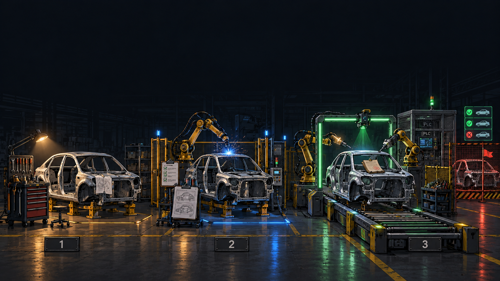

<style>
@import url('https://fonts.googleapis.com/css2?family=Fira+Code:wght@400;500;700&family=Inter:wght@400;600;700&display=swap');

:root {
  --color-background: #0d1117;
  --color-foreground: #c9d1d9;
  --color-heading: #58a6ff;
  --color-accent: #7ee787;
  --color-code-bg: #161b22;
  --color-border: #30363d;
}

section {
  background-color: var(--color-background);
  color: var(--color-foreground);
  font-family: 'Inter', sans-serif;
  font-size: 22px;
  padding: 52px 56px;
  border-left: 4px solid var(--color-accent);
}

h1, h2, h3 {
  font-family: 'Fira Code', monospace;
  font-weight: 700;
  color: var(--color-heading);
}

h1 { font-size: 46px; }
h1::before { content: '# '; color: var(--color-accent); }
h2 { font-size: 34px; margin-bottom: 28px; padding-bottom: 10px; border-bottom: 2px solid var(--color-border); }
h2::before { content: '## '; color: var(--color-accent); }

ul, ol { padding-left: 30px; }
li { margin-bottom: 8px; }
li::marker { color: var(--color-accent); }
strong { color: var(--color-accent); }

pre {
  background-color: var(--color-code-bg);
  border: 1px solid var(--color-border);
  border-radius: 6px;
  padding: 14px 16px;
  font-size: 15px;
  line-height: 1.5;
}
code {
  background-color: var(--color-code-bg);
  color: var(--color-accent);
  padding: 2px 6px;
  border-radius: 3px;
  font-family: 'Fira Code', monospace;
  font-size: 0.88em;
}
pre code { background-color: transparent; padding: 0; color: var(--color-foreground); }

/* highlight.js tokens - github-dark palette for the dark stage */
.hljs-attr { color: #79c0ff; }
.hljs-string, .hljs-string .hljs-subst { color: #a5d6ff; }
.hljs-bullet, .hljs-number, .hljs-literal { color: #79c0ff; }
.hljs-keyword, .hljs-selector-tag { color: #ff7b72; }
.hljs-comment, .hljs-quote { color: #8b949e; font-style: italic; }
.hljs-title, .hljs-section, .hljs-name { color: #7ee787; }
.hljs-variable, .hljs-template-variable { color: #ffa657; }
.hljs-type, .hljs-built_in { color: #ffa657; }
.hljs-symbol, .hljs-meta { color: #79c0ff; }
.hljs-addition { color: #aff5b4; }
.hljs-deletion { color: #ffdcd7; }
.hljs-emphasis { font-style: italic; }

table { font-size: 17px; border-collapse: collapse; }
th {
  background-color: var(--color-code-bg);
  color: var(--color-accent);
  border: 1px solid var(--color-border);
  padding: 8px 14px;
  font-family: 'Fira Code', monospace;
}
td {
  border: 1px solid var(--color-border);
  padding: 8px 14px;
  color: var(--color-foreground);
}
tr:nth-child(even) td { background-color: rgba(22, 27, 34, 0.6); }
blockquote { font-size: 21px; border-left: 3px solid var(--color-accent); }

header { font-size: 14px; color: #8b949e; font-family: 'Fira Code', monospace; }
header strong { color: #58a6ff; }

footer { font-size: 13px; color: #6e7681; font-family: 'Fira Code', monospace; }
footer::before { content: '// '; color: var(--color-accent); }

section.title-slide {
  background: linear-gradient(135deg, #0f172a 0%, #1e293b 50%, #0f172a 100%);
  justify-content: center;
}
section.title h1 { font-size: 34px; text-shadow: 0 2px 14px rgba(0,0,0,0.95); }
section.title h1::before { content: none; }
section.title h2 { font-size: 23px; border-bottom: none; text-shadow: 0 2px 10px rgba(0,0,0,0.95); }
section.title h2::before { content: none; }
section.title { border-left: none; }
section.part-model,
section.part-upgrades,
section.part-run,
section.title-slide {
  --h1-color: #fff;
  color: white;
}
section.part-model h1, section.part-upgrades h1, section.part-run h1 { color: #fff; }
section.part-model { background: linear-gradient(135deg, #1e3a5f 0%, #2d5a8e 100%); }
section.part-upgrades { background: linear-gradient(135deg, #064e3b 0%, #047857 100%); }
section.part-run { background: linear-gradient(135deg, #3d1e5c 0%, #5a2d8e 100%); }
</style>

<!-- footer: "" -->
<!-- _header: "" -->
<!-- _class: title -->



# Delivering more robust code safely using custom skills. A personal experiment extending the Superpowers skill

## From one prompt to a reviewed pull request — the machinery in between

<!--
Talk track:
- Same chassis, three stations. Left: hand tools and taped-up notes. Middle: one robot, a half-built fence, a clipboard. Right: the full line, conveyor, scanner gate, control booth.
- This talk walks that floor left to right. What each station added, what failure paid for it, what it costs. Then you get the keys to run station three yourself.
- No superpowers knowledge assumed. Half 2, later, takes the finished car to the test track.
-->

---

<!-- header: "" -->

# Questions this talk answers

1. **What changes** - vanilla, superpowers, fr-goal side by side
2. **Why each upgrade** - the failure that paid for it
3. **How do I start** - profiles, first goal, acceptance rows

<!--
Talk track:
- Three promises. One: a mental model you can hold in your head, the shape and the cursor.
- Two: honesty about cost. Every mechanism here slowed something down to prevent something worse. You get the failure stories, not just the features.
- Three: runnable. Install, profile interview, first goal, acceptance rows. If the wifi holds there may be a live command or two.
-->

---

<!-- _class: lead title-slide -->
<!-- header: "" -->
<!-- footer: "" -->

# Agenda

### Stages 1-3: the evolutions
Vanilla, then superpowers, then fr-goal - same job, three species

### Then: justified upgrades
Each super-fr addition with the failure that paid for it

### Close: run it
Your first goal plus where to go next

<!--
Talk track:
- Shapes first, upgrades second. The model gives each upgrade somewhere to hang. Then we get practical.
- Part 1 is the only abstract part. Survive it and the rest is stories plus commands.
-->

---

<!-- _header: "" -->
<!-- _class: lead part-model -->

# Stage 1: vanilla prompts

**One checkout, one chat, no artifacts - fast until the second feature**

<!--
Talk track:
- Meet Charmander. You prompt, the model plans in chat, codes in your checkout, you eyeball it and push.
- Nothing here is wrong at small scale. Everything here breaks at the second concurrent feature: the plan lives in chat history, the half-done state lives in your checkout, done means it looked right.
- Keep this slide in mind. Every later stage is a response to something on it.
-->

---

<!-- header: "**Stages** > Upgrades > Run it" -->

## Vanilla cycle


```
prompt ──▶ plan in chat ──▶ code in base ──▶ eyeball ──▶ push?
```

- Plan lives in chat, dies with compaction
- Half-done state lives in your checkout
- Done means it looked right to someone tired

<!--
Talk track:
- Four boxes and a question mark. The plan is a rumor the chat tells itself. Your checkout holds finished work and half-thoughts side by side.
- Verification is eyeballing. There is no gate that can say no.
- This is the baseline the next two evolutions upgrade. Charmander is beloved and completely unequipped.
-->

---

<!-- header: "**Stages** > Upgrades > Run it" -->

## Superpowers run


```
idea ──▶ brainstorm ──▶ write plan ──▶ worktree ──▶ execute+TDD ──▶ verify→review→fix ──▶ finish
```

- `brainstorming` ends in an approved spec, no code before it
- `writing-plans` yields a zero-context plan, reviewer loop included
- Iron laws: failing test first, evidence before any claim

<!--
Talk track:
- Charmeleon. Same job, now with structure: brainstorming produces a spec markdown and refuses code until the design is approved. Writing-plans produces a plan markdown a fresh session could execute.
- Execution picks subagent-driven or inline, test-driven-development runs the red-green-refactor loop inside, verification-before-completion forbids completion claims without a fresh full-command run.
- Review is double-sided: requesting dispatches a SHA-scoped review, receiving bans performative agreement and demands verification. Finishing offers four options and cleans up the worktree.
- Gaps remain, and they are the next slide deck: one markdown plan, session memory doing the carrying, worktree as a sidecar.
-->

---

<!-- header: "**Stages** > Upgrades > Run it" -->

## fr-goal run


```
brainstorm ──▶ spec-review ──▶ plan ──▶ plan-review ──▶ implement ×N ──▶ review ──▶ deliver
```

- Shape is data: `kind: cli` runs, `kind: agent` briefs, `gate` stops
- Run file on the branch, failed step holds the cursor
- Workspace first: worktree plus container, then the run

<!--
Talk track:
- Charizard. Same shape as Charmeleon, new species: the pipeline is a yaml manifest that validates, the cursor is a file on your branch that survives compaction, and isolation is mandatory worktree plus devcontainer, not a sidecar.
- Cli steps execute with exit code as verdict. Agent steps print a brief, you work, you resolve. The single operator gate is the batched question round.
- Everything after this slide is one super-fr addition presented as the upgrade it is: what superpowers lacked, what failure paid for it, what it costs.
-->

---

<!-- _header: "" -->
<!-- _class: lead part-upgrades -->

# Upgrades, each justified

**What superpowers lacked, the failure that paid, what it costs**

<!--
Talk track:
- The evolutions showed the what. These next slides show the why, one upgrade at a time. Each follows the same shape: what superpowers lacked, the failure that paid for the addition, what it costs you.
-->

---

<!-- header: "Stages > **Upgrades** > Run it" -->

## Pipeline as data

```yaml
- id: brainstorm
  kind: agent
  skill: super-fr:fr-brainstorming
  gate: operator
  emits: [spec]
- id: plan-review
  kind: cli
  run: fr plan self-review {{ artifacts.plan }}
```

- `kind: cli` runs, exit code is the verdict
- `kind: agent` briefs, you work, then `fr run resolve`
- `gate: operator` stops until a person answers

<!--
Talk track:
- This is a real fragment of fr-goal.yaml. A shape is an ordered list of steps plus what each step needs and emits.
- Cli steps are deterministic, nobody interprets them. Agent steps never execute inside fr, it prints a brief, you do the work, you resolve. The gate is the one promised stop.
- Consequence: the engine is a plain program with no path to a language model. Every judgment happens on the far side of a visible handoff.
- Full file: plugins/super-fr/workflows/fr-goal.yaml, six steps plus two grouped children under implement.
-->

---

<!-- header: "Stages > **Upgrades** > Run it" -->

## One question round

- Agent studies the code first, then asks once, max four
- Recommended options first, unanswered means stop
- Spec and plan reviews become fix passes, not approvals

> Dripped interruptions and guessed scope die here

<!--
Talk track:
- Before: decisions arrived one at a time across days, and anything unanswered got guessed. So exploration first, then a single batched round. Four questions max forces the agent to rank what is truly operator-owned.
- Unanswered is a stop, never a default. After that the agent owes you no more approvals, it owes you fix passes.
- Post-merge test plan and model-per-tier questions ride the same round when relevant.
-->

---

<!-- header: "Stages > **Upgrades** > Run it" -->

## Proof, not promises

| Status | Meaning |
|---|---|
| `not-implemented` | Claimed, nothing yet |
| `skipped` | Proven once, not in CI |
| `ci` / `scheduled` | Automated, cannot drift |
| `failing` | Red by design, blocks CI |

- Rows born at brainstorm, one-line defense each
- Phases link rows, self-review enforces it

<!--
Talk track:
- Before: suite green, feature not doing the thing. So acceptance rows in docs/acceptance/matrix.yaml, one operator-can-X per row, flipped up only with test evidence.
- Rows are presented with defenses at brainstorm close. Silent creation is not agreement on scope.
- The plan links phases to rows and the gate errors on unlinked test-plan specs. Debt stays visible in the pull request, embarrassing by design.
-->

---

<!-- header: "Stages > **Upgrades** > Run it" -->

## Plans a tool can read

- Folder per plan: `_meta.yaml`, `_prose.md`, one file per phase
- Step ids `P1.T1.S1`, dependencies explicit
- `fr plan self-review`: cycles, hidden manual work, bad links

> Manual work ships labeled `[manual]`, never smuggled in

<!--
Talk track:
- Before: the single markdown plan, unmergeable, position kept in the model's head. Per-phase files also kill merge conflicts.
- Self-review runs before any token burns on implementation: dependency cycles, manual work hiding in agentic phases, unknown acceptance ids.
- Manual phases back-load by default, the pull request ships them unimplemented and you push to the same branch. Front-load only when agentic work genuinely depends.
-->

---

<!-- header: "Stages > **Upgrades** > Run it" -->

## Loop until reviewed

- One executor per phase, briefed from the journal
- Failing test, implement, refactor, per-phase review
- Draft PR first, ready only when green

> Fixes orphaned on merged branches and silent no-op runs both bit us

<!--
Talk track:
- Two lessons in one slide. Fixes pushed after a premature merge landed on dead branches, so now draft first and the push guard refuses merged-branch pushes.
- And the healthy-looking run that did nothing: a phase executor in a second worktree cut from main cannot see the spec, so the no-worktree carve-out is enforced by a hook, not by prose.
- Review findings are fixed with tests or refuted with reasoning, recorded open, fixed, or refuted. The pull request body is rendered from that list.
-->

---

<!-- header: "Stages > **Upgrades** > Run it" -->

## Small jobs, same discipline

- `fr-brainstorming`: design in isolation, approvals included
- `fr-debugging`: Iron Law, journaled trail, one fix-PR
- `fr-plan`, `fr-init`, `fr-progress`: authoring, setup, drift audit

> Not every job needs the pipeline - but every job keeps isolation

<!--
Talk track:
- Upgrade in miniature: the pipeline's steps usable alone. Brainstorming keeps section approvals when standalone, debugging reuses the feature workspace when the bug surfaces mid-goal.
- The debugging journal is the idea I would steal for any workflow: rejected hypotheses written down before compaction eats them.
-->

---

<!-- header: "Stages > **Upgrades** > Run it" -->

## Same CLI, every harness

- Claude Code: full hook surface plus executor and push guards
- OpenCode: edit guard ported, bash ungated - known gap
- Hermes: context-carried briefs, no shipped model bindings
- Git servers: `gh`, `glab`, `tea` behind one backend switch

> `fr run` is a CLI surface, not a prompt - every harness drives it alike

<!--
Talk track:
- If time dies, this slide dies first. One line each: Claude is the reference, OpenCode has a documented bash gap, Hermes dispatches through context, git hosts are detected backends.
- The point for Monday: learn the CLI once, it follows you across harnesses.
-->

---

<!-- _header: "" -->
<!-- _class: lead part-run -->

# Run it

**From zero to first reviewed pull request**

<!--
Talk track:
- Theory over. This part is a checklist you can follow Monday. Four moves plus pointers.
-->

---

<!-- header: "Stages > Upgrades > **Run it**" -->

## First goal in four moves

```bash
curl -fsSL .../bootstrap.sh | bash   # install fr plus plugins
fr-init                               # interview, scaffold a profile
/fr-goal <what you want>              # answer once, then watch
fr acceptance status                  # flip rows as evidence lands
```

- Standalone when small: `fr-brainstorming`, `fr-debugging`, `fr-plan`
- Custom pipeline: your own `workflows/<name>.yaml`, validated by check
- Scale out: `fr apply --to <runner>` fans merged phases to agents

<!--
Talk track:
- Move one installs everything and wires the harness you have. Move two is the only interview in the system and it exists because isolation without a profile is a hard stop, not a degraded mode.
- Move three is the whole talk in one command. Answer the round, then the shape drives.
- Move four keeps you honest. Standalone skills cover the small jobs. A custom shape is a yaml file plus check. Dispatch is for merged plans with per-phase pull requests.
- Repos resolve runners and git hosts the same way everywhere, one CLI surface per harness.
-->

---

<!-- header: "Stages > Upgrades > **Run it**" -->

## Takeaways

1. **Pipeline is data** - shapes validate, resolve, and re-run
2. **Progress is a file** - cursor on the branch, failure holds still
3. **Work is isolated** - worktree plus container, no fallback
4. **Done means proven** - acceptance rows plus review findings

Next: half 2 measures all of this, same prompt twice, counted live

<!--
Talk track:
- Four sentences to carry out. If you remember nothing else: data, file, isolation, proof.
- My position, stated plainly: the ceremony earns its keep. Each row of ceremony exists because the un-ceremonied version failed on a real feature.
- Half 2 is the audit. Same seed prompt, same pinned model, every nudge logged, side-by-side recording. The table gets to disagree with me.
- Thank you. Questions, then your first goal whenever you are ready.
-->
